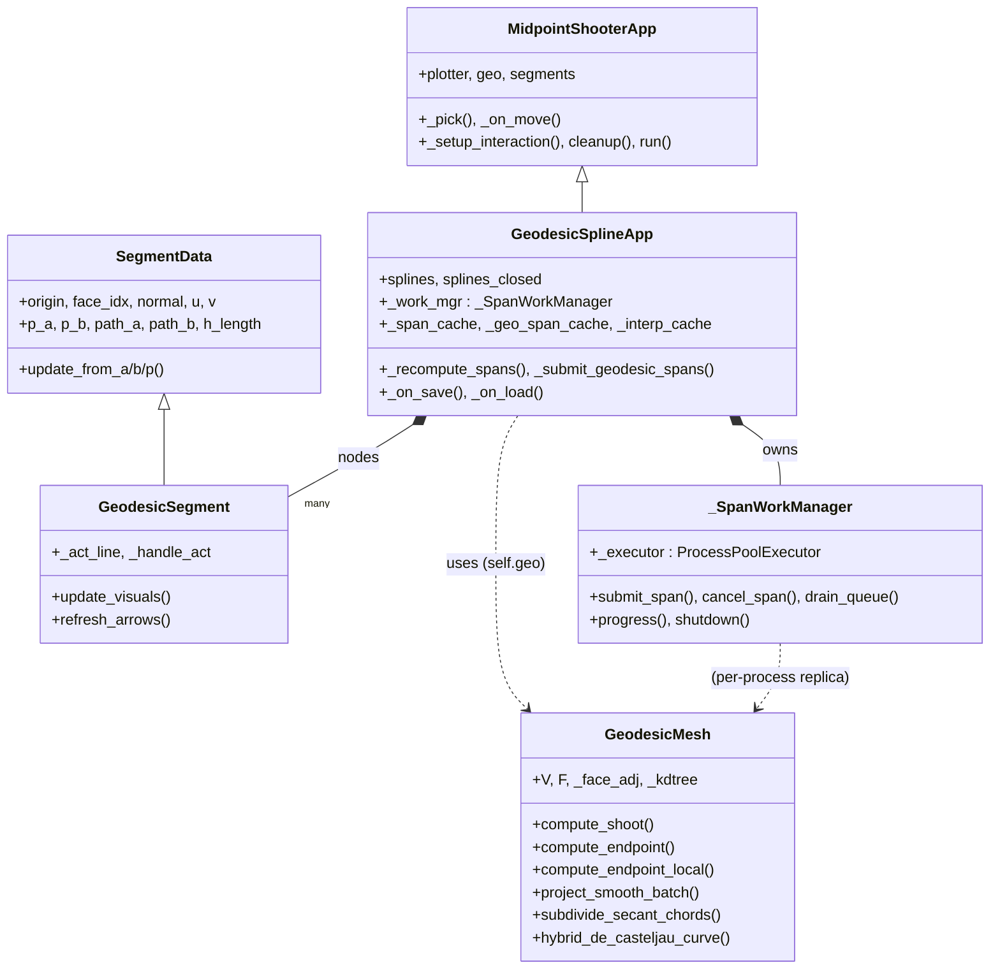
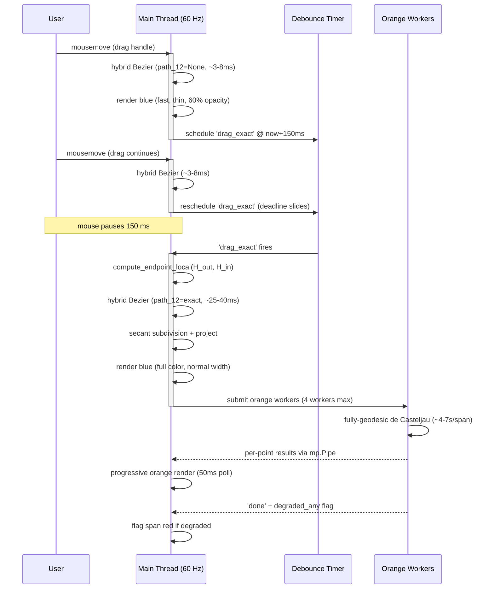

# Geodesic Spline Editor

Interactive multi-spline editor for 3D triangulated meshes. Combines exact
discrete geodesic computation with cubic Bezier interpolation to produce
smooth curves that lie precisely on the surface.

## 🎯 Why this matters? (Geodesic vs. Euclidean Splines)

If you have ever tried to draw a smooth curve on a 3D scanned mesh or an
STL file using standard 3D software, you have likely encountered the
**Projection Problem**.

Most commercial 3D tools (Blender, Maya, CAD projection tools) "cheat"
when drawing curves on meshes. They compute the spline in empty 3D space
(Euclidean space) and then forcefully project it down onto the nearest
surface polygons (e.g. Shrinkwrap).

This creates severe artifacts on complex geometry:

- **The "Rubber Band" effect**: in concave areas (like the inside of a
  bowl or the folds of an ear), the curve jumps off the surface and
  floats in the air.
- **Mesh Penetration**: in convex areas (like sharp ridges), the
  Euclidean curve cuts straight through the inside of the mesh.
- **Length Distortion**: the arc-length of the projected curve is
  mathematically wrong, making it useless for precise manufacturing
  (fabric pattern cutting, CNC routing).

This editor solves the problem by computing **true discrete geodesics**.
Instead of projecting a floating curve, the engine computes the spline
intrinsically over the surface manifold. Using the **Edge-Flip Geodesic
Solver** (Sharp & Crane 2020, via [potpourri3d](https://github.com/nmwsharp/potpourri3d))
under the hood, the curve travels exactly across the faces of the
triangles.

The result:

- **Zero Penetration**: the curve behaves like a physical string wrapped
  tightly around the object. It hugs every ridge and valley of the
  underlying triangulation exactly.
- **True Arc-Length**: every segment is mathematically exact. The
  distance measured along the spline is the true distance across the
  surface.
- **Real-Time Interaction**: historically, exact geodesic math is too
  slow for interactive UIs. By combining a [local sub-mesh solver](#local-submesh-solver-compute_endpoint_local),
  [Numba JIT-compiled kernels](#numba-jit-kernels), and
  [asynchronous background workers](#background-workers), this tool
  brings academic-grade computational geometry into a fluid interactive
  editing experience.

**Perfect for**: reverse engineering, carbon-fiber layup paths, custom
orthotics on 3D scans, and precise fabric pattern flattening.

## Quick Start

```bash
# Install dependencies (pinned in requirements.txt)
pip install -r requirements.txt

# No argument -> opens fandisk.obj if present in the current directory,
# otherwise falls back to the in-memory icosahedron demo mesh.
python geo_splines.py

# Open a specific mesh file (any VTK-supported format: .obj, .ply, .stl, ...)
python geo_splines.py mesh.ply
python geo_splines.py custom.obj

# Resume a saved session (loads the mesh referenced inside the JSON)
python geo_splines.py session.json
```

Requires Python 3.10+ (see `pyproject.toml`).
`potpourri3d` needs a C++17 compiler on first install
(MSVC 2022 Build Tools on Windows, gcc >= 9 on Linux).

The session JSON references the source mesh via the `mesh_file` field.
The string `__builtin__:icosahedron` (or the legacy plain `ICOSAHEDRON`)
is reserved for the in-memory demo mesh; any other value is treated as
a filesystem path.

## Architecture

The system is split into four modules with clear responsibilities:

| Module | Role |
|---|---|
| `geodesics.py` | Geodesic algorithms: shooting, endpoint solving, topology insertion, surface projection, Numba JIT kernels |
| `gizmo.py` | `SegmentData` (pure geometry) + `GeodesicSegment` (VTK rendering) for interactive ray-pair widgets |
| `geo_shoot.py` | `MidpointShooterApp` base app: plotter, picking, cursor, debounce timer, drag lifecycle |
| `geo_splines.py` | `GeodesicSplineApp`: multi-node splines, three curve layers, background workers, save/load, CLI |
| `spline_export.py` | Command-line curve exporter (JSON to CSV) |

### Class diagram



## Interaction

### Mouse

| Action | Effect |
|---|---|
| Double-click Left | Add node at end of active spline, or insert at curve hover point |
| Double-click Right | On red P marker: open a coordinate-edit dialog (type `[x, y, z]` / `x, y, z` / `x y z`; live validation, Enter accepts when valid, Escape cancels). Coordinates are projected onto the closest surface point and the node is moved there via parallel transport. On empty surface: start a new spline (break). |
| Drag Red (P) | Translate node on surface (parallel transport preserves tangent) |
| Drag Blue/Green (A/B) | Adjust tangent direction and length (symmetric ray update) |
| Shift + Drag (P) | Snap drag target to the nearest mesh vertex.  A gold sphere shows the exact target while held.  Only applies to the red P marker — Shift on A / B has a different meaning (see below). |
| Shift + Drag (A / B) | **Magnitude-only mode** for the tangent: preserves direction (no rotation), the opposite handle stays symmetric (C1 continuity preserved).  The cursor is projected onto the dragged handle's tangent direction at the origin (3-D dot product); the magnitude of that projection becomes the new arc-length.  When the cursor crosses the origin (negative projection), the tangent direction flips so the handle visibly tracks the cursor.  **Vertex snap is disabled on A / B**: snapping would discretise the magnitude scalar and defeat the smooth-scrub UX. |
| Ctrl + Drag | Snap drag target to the nearest edge of the face under the cursor (perpendicular projection, clamped). Gold sphere indicator while held. |

### Keyboard

| Key | Action |
|---|---|
| C | Toggle close/open spline loop (3+ nodes). Auto-break on close. |
| Backspace | Undo last node or break |
| Ctrl+Z | Undo (snapshot-based, up to 50 levels) |
| Ctrl+Y | Redo |
| b / o / k | Toggle blue / orange / interp curve visibility |
| t | Cycle gizmo opacity (0.2, 0.4, 0.7, 1.0) |
| r | Rebuild all orange (fully geodesic) curves -- handy after layer toggles, loads, or worker crashes |
| s | Save splines to timestamped JSON (atomic UTF-8 write) |
| l | Load splines from JSON (file dialog; schema-validated) |
| v | Export orange curve to timestamped binary `.vtk` (same output as `spline_export.py --vtk --samples N` with `N = SplineConfig.EXPORT_VTK_SAMPLES`; reuses live cache when `EXPORT_VTK_SAMPLES == GEO_SAMPLES`, otherwise recomputes).  Single-node splines are written as `VTK_VERTEX` landmarks. |
| d | Toggle the **didactic scaffold** for the active spline's last span — four dark-green auxiliary geodesic lines that visualise the de Casteljau cascade at `t = 0.5`.  See the dedicated [Didactic Scaffold](#didactic-scaffold-key-d) section below for the full geometric story. |
| e | Export geodesic paths to TXT |
| w | Toggle wireframe overlay |
| a | Cycle surface transparency |

### Logging

All HUD text and diagnostic output are in English (the project no
longer ships a localisation table; an earlier `GEO_SPLINES_LANG`
switch was removed when the codebase consolidated on a single
language).  Diagnostics route through Python `logging` under the
`geo_splines` logger.  Set `GEO_SPLINES_DEBUG=1` to raise the level
to `DEBUG` (worker traces, snap diagnostics, solver fallbacks).

### Checkboxes

Three colored checkboxes (bottom-left) mirror the b/o/k keys for
layer visibility.

## The Spline Model

Each spline is a chain of nodes. Between consecutive nodes, a **span** is
drawn as a cubic Bezier curve through four control points:

```
[node_i.origin,  node_i.p_b,  node_{i+1}.p_a,  node_{i+1}.origin]
```

The handles `p_a` and `p_b` are geodesic endpoints computed by shooting
symmetric rays from the node origin. They lie exactly on the surface with
known geodesic paths connecting them to their node.

### C1 Continuity

Every node enforces C1 continuity: handles `p_a` and `p_b` depart in
exactly opposite tangent-plane directions with equal arc-lengths. When
the user drags one handle, the opposite is recomputed automatically to
maintain symmetry.

### Closed Loops

Pressing C on a 3+ node spline closes the loop by computing a
closing tangent on the first node (`p_a` toward the last node) and
adding a wrap-around span.

## Three Curve Layers

Each spline has up to three simultaneous curve representations with
increasing accuracy and computational cost.

> **Default visibility at startup**: only the blue layer is shown.
> Orange (`'o'`) and interp (`'k'`) start hidden — orange because it is
> heavy to compute (the background workers run regardless of visibility,
> so toggling on shows whatever is already done) and interp because it
> is purely a B-spline through node origins, useful but rarely the
> primary signal.  Press the corresponding key to toggle.

### Blue -- Bezier (dual-mode)

The workhorse curve — always visible, accurate.  Dual-mode:

- **During drag** (~3-8 ms per span): fast hybrid.  Level-1 geodesic
  lerp on the two outer paths (`path_b`, `path_a`), Euclidean lerp +
  projection on H_out→H_in.  Levels 2-3 Euclidean + projection.  The
  expensive `compute_endpoint_local` call is *skipped* during drag —
  that is what makes the preview cheap, not the sample count, so blue
  uses the same density as the resting curve and the polyline is
  visually smooth even mid-gesture.
- **On consolidation** (debounce fires, ~25-40 ms per span):
  semi-geodesic.  `compute_endpoint_local` provides an exact geodesic
  `path_12` between H_out and H_in, so level-1 is fully geodesic.
  Levels 2-3 remain Euclidean + projection.  Cost is dominated by the
  solver call (~25 ms) rather than the de Casteljau levels.

This dual-mode keeps interactive drag fluid while snapping to accurate
geometry the moment the user stops moving.  Computed synchronously in
the main thread inside `_recompute_spans` — no background worker.

#### Dual-mode Timeline




### Orange -- Fully Geodesic de Casteljau (~4-7 s per span)

- All three de Casteljau levels use geodesic interpolation.
- ~4 `compute_endpoint_local` calls per sample point (submesh solver,
  ~6x faster than global; all intermediate de Casteljau points are
  close enough that the local submesh almost never fails).
- Computed in background processes (max 4).
- `GEO_SAMPLES = 33` (= 2^5 + 1) — 5 clean binary-subdivision levels.
- **Progressive hierarchical refinement**: the worker computes points
  in midpoint → quarter → eighth → ... order (not t=0 to t=1).  The
  main thread stores results in a sparse buffer pre-seeded with the
  two node origins, so the curve is visible from submission-time as
  a 2-point stub that **refines in detail** rather than growing from
  one end.  User sees the overall shape in ~150 ms instead of waiting
  several seconds for a snake to traverse the span.

#### Progress feedback

The orange layer has two visual signals that it is still computing:

- **Dimmer color** (`GEO_COLOR_COMPUTING`, `#b85a00`) while the worker
  is active; switches to full orange (`GEO_COLOR`, `#ff8800`) on the
  'done' message.  Clear binary "working / done" indicator.
- **Dashed polyline** (optional, `GEO_DASHED_WHILE_COMPUTING = True`):
  during computation, only the odd 1-indexed segments of the polyline
  are rendered, producing a visible dashing pattern that densifies as
  more points arrive.  Consolidation switches back to a solid
  polyline.  Disable the flag for a solid-dimmer look without dashes.

Degraded spans (geodesic fell back to a straight line) are painted
`SPAN_FALLBACK_COLOR` regardless of the computing state — a failure
signal dominates any progress indicator.

#### Didactic scaffold (key `d`)

A toggleable visualisation of the de Casteljau cascade for the
active spline's **last span** at parameter `t = 0.5`.  Useful for
teaching, debugging, or just understanding what the orange curve is
doing under the hood.  Pressing `d` draws four dark-green geodesic
auxiliary lines:

| Line | Endpoints | Stage of the cascade |
|---|---|---|
| `path_12`    | `H_out ↔ H_in`   | Level 1: middle segment between the two handles. |
| `path_c0`    | `b01 ↔ b12`      | Level 2: first chord between consecutive level-1 midpoints. |
| `path_c1`    | `b12 ↔ b23`      | Level 2: second chord. |
| `path_final` | `c0 ↔ c1`        | Level 3: collapses to the orange curve sample at `t = 0.5`. |

The intermediate points themselves (`b01`, `b12`, `b23`, `c0`, `c1`)
are computed via geodesic_lerp on the level-N paths but not drawn
as markers — the lines alone make the structure readable.

"Last span" means:
- **Open spline** of N nodes: span between `nodes[N-2]` and `nodes[N-1]`.
- **Closed spline**: the wrap-around span between `nodes[N-1]` and `nodes[0]`.
- Active spline with **<2 nodes**: a brief HUD message
  (`DIDACTIC: no last span`) and nothing is drawn.

**On-demand semantics**: while the scaffold is invisible, no compute
runs.  Toggling ON triggers a synchronous rebuild (~75-125 ms — four
``compute_endpoint_local`` calls).  Drag invalidates the cache and
hides the actors so the per-frame cost stays zero.  Consolidation
(``_recompute_spans`` with ``is_dragging=False``) re-renders the
scaffold if it is currently visible.

Opacity tracks the global handle opacity (cycled with `t`), so the
scaffold fades together with the node markers and tangent arrows.

### Black -- Interpolation B-spline (immediate)

**Philosophy: fast and rough.** This is a quick-and-dirty curve that
gives immediate visual feedback of the overall spline shape. It has no
geodesic awareness — it is a pure 3D B-spline projected onto the
surface after the fact. The trade-off is speed over accuracy: a new
AI or developer reading this code should understand that this layer
exists for responsiveness, not for geometric correctness.

- Scipy `splprep`/`splev` B-spline interpolating the node origins.
- NOT a Bezier: no handles, no de Casteljau — purely node-defined.
- Degree: `min(3, n_nodes - 1)`. Closed splines use `per=True`.
- Projected onto the surface via `project_smooth_batch`.
- **Dedicated secant subdivision** with tighter parameters than Bezier
  layers, because the 3D B-spline can deviate further from the surface:
  - `INTERP_MIN_SAMPLES = 200` (high base count for short chords)
  - `INTERP_SECANT_TOL_FACTOR = 0.002` (5x tighter than Bezier's 0.01)
  - `INTERP_SECANT_MAX_DEPTH = 8` (256x local refinement)
- Cost: ~1-5 ms.  Computed synchronously on the main thread.
  **Visibility-gated**: while the layer is hidden (the default at startup),
  `_recompute_interp_curve` is short-circuited so the splprep / splev /
  project chain does not steal frames from the visible layers during
  drag.  On the OFF→ON transition `_toggle_layer` triggers a one-shot
  recompute across all splines so the curve appears immediately at full
  quality.  Unlike orange (which always computes via background workers),
  interp must run on the main thread, so the gating matters.
- Toggle: key `k`. Z-depth -6 (behind all Bezier layers).
- Cache: `_interp_cache` keyed by spline index (one curve per spline,
  not per span like the Bezier layers).

### Visual Z-Order

Layers are stacked with increasing depth priority:

| Layer | Depth offset | Visual position |
|---|---|---|
| Black (interpolation) | -6 | Far back |
| Blue (Bezier) | -8 | Middle |
| Orange (fully geodesic) | -20 | Front |

## Geodesic Algorithms

### Shooting -- The Unrolling Algorithm (`compute_shoot`)

Traces a geodesic ray from a point in a given tangent direction for a
prescribed arc-length. A geodesic on a triangle mesh is a straight line
within each face that changes direction only at edge crossings. The
algorithm "unrolls" adjacent triangles into a common plane -- the ray
travels straight, and only the mesh topology causes direction changes.

The inner loop (7 phases per edge crossing):

1. **Project direction** onto the face tangent plane (remove normal
   component, renormalize).
2. **Ray-edge intersection** (`_ray_edge_jit`): intersect the ray with
   all 3 edges of the current triangle. Uses the determinant form
   `(d x edge) . n` with three numerical thresholds:
   - `det_tol = 1e-10 * edge_len^2` -- scale-invariant parallelism test.
   - `s_tol = 1e-4` -- edge parametric bounds with clamping.
   - `t_min = -1e-8` -- accepts intersections at the current position
     (after the 1e-7 nudge from the previous step).
3. **Arc-length check**: if remaining distance fits within the face,
   place the final point via linear interpolation and stop.
4. **Record edge crossing** in the pre-allocated path buffer, advance
   remaining arc-length.
5. **Cross to adjacent face** via `_face_adj[fi, edge_i]` -- an (M, 3)
   int32 matrix giving O(1) neighbor lookup. Built once at init via
   vectorized edge-key sorting (no Python loops over faces).
6. **Parallel transport** the direction vector across the shared edge.
   Decomposes the vector into components parallel and perpendicular to
   the edge, rotates the perpendicular component through the dihedral
   angle, reassembles. Fully inlined scalar math (no numpy calls).
   When `fast_mode=True` (preview/crosshair), a cheaper re-projection
   replaces the full transport.
7. **Nudge** the current position 1e-7 past the edge boundary to prevent
   the next iteration from re-intersecting the same edge.

**Vertex/edge fallback** (Phase 2b): when ray-edge intersection fails
(degenerate triangle, all determinants near-zero), the algorithm finds
the nearest vertex of the current face, iterates its adjacent faces via
the CSR arrays `(vf_data, vf_offsets)`, projects the direction onto each
candidate face's tangent plane, and picks the best continuation. This
replaces the KDTree.query that the original Python version used -- the
JIT kernel cannot call scipy, but the local vertex search is sufficient
because the failure case always occurs at a vertex/edge boundary.

The entire loop is compiled to native code via
`@njit(cache=True, fastmath=True)`.

### Endpoint Solving (`compute_endpoint`)

Finds the shortest geodesic between two arbitrary surface points using
the Edge-Flip algorithm (potpourri3d / geometry-central):

1. Create working copies of V and F arrays (pre-allocated buffers,
   oversized by a few slots to avoid per-call allocation of 120K
   vertices).
2. Insert both endpoints into the mesh topology via **1-to-3 face
   subdivision**. Points near edges (barycentric coord < 1e-3) are
   nudged ~1% of the shortest edge length toward the face centroid
   (clamped to [1e-6, 1e-2]) to prevent sliver triangles with
   near-zero area. A post-subdivision area check verifies all
   sub-triangles; if any is degenerate, the insertion falls back
   to vertex snap.
3. **Remove degenerate faces** (self-edges) from the modified topology
   via a vectorized check `F[:,0] != F[:,1]` etc.
4. Build an `EdgeFlipGeodesicSolver` on the modified mesh.
5. Extract the geodesic path between the two inserted vertices.

**Connected component check**: before any of the above, the method
verifies that both endpoints lie on the same connected component of
the mesh (via pre-computed face labels from BFS on the face adjacency
graph). If they are on disconnected components (islands), a
straight-line fallback `[p_start, p_end]` is returned immediately --
no solver invocation, no silent garbage.

If the solver rejects the mesh, the insertion is **retried** with both
points nudged toward their face centroids (nudge fraction relative to
the shortest edge, same clamping as above). Only if the retry also
fails, falls back to vertex-snapped geodesic via the pre-built solver.

### Local Submesh Solver (`compute_endpoint_local`)

`compute_endpoint_local` is the workhorse geodesic solver for all
interactive paths in the app.  Instead of building the
`EdgeFlipGeodesicSolver` on the full mesh (~250-350 ms on a 240K-face
mesh), it constructs the solver on a small submesh extracted around
the two endpoints (~5-25 ms).

**Used by:**

- **Blue layer consolidation** (`_recompute_spans`): when the debounce
  fires, the blue Bezier is upgraded from fast hybrid to semi-geodesic
  by passing the exact `path_12` to `hybrid_de_casteljau_curve`.
- **Orange layer** (`_geodesic_decasteljau_worker`): all 4 geodesic
  calls per sample point (level-1 path_12 + 3 de Casteljau levels).
- **Handle drag** (`compute_endpoint_from_origin`): when a user drags
  a handle A or B, the debounce-consolidated geodesic from node origin
  to the new handle position (~40× faster than global solver).
- **CLI export** (`spline_export.py`): all geodesic calculations for
  blue and orange curves.

#### Projected-Line Pre-filter

The submesh seed is the **projection of the straight euclidean line
A→B onto the mesh surface**:

1. Sample `[A, B]` with 100 points in 3D (euclidean linspace).
2. `project_smooth_batch_with_faces` projects each sample onto its
   closest triangle and returns the face index.  Vectorised Numba
   kernel (~500 µs for 100 points on a 250K-face mesh).
3. The set of hit faces forms a **narrow tube that follows the real
   terrain**: on a ridge, the tube climbs and descends with the surface;
   in flat regions, it is a straight strip.
4. Belt-and-suspenders: the 1-ring of the endpoint faces
   (`_faces_for_point`) is union-merged into the seed so that the
   topology insertion can never miss the origin/target face.

Why this beats a spherical / bounding-box filter:

- **Ridges and valleys**: a sphere centred on the euclidean midpoint
  cuts through the mountain — the solver then has to reach around,
  often triggering the boundary-check fallback.  The projected line
  already includes the ridge faces because that is where the straight
  line *is*, projected.
- **Tight tube**: typically captures ~100-300 faces vs ~500-2000 for
  the sphere, so the `EdgeFlipGeodesicSolver` construction is faster.
- **Scales to any topology**: no assumptions about where the geodesic
  "should" be — the projection finds it automatically.

#### Adaptive Retry

The submesh is expanded by increasing topological rings on each
failure (boundary touch or solver exception):

| Attempt | k_rings | Submesh size (typ.) |
|---|---|---|
| 1 | 3 | seed + 3 rings (tight) |
| 2 | 7 | seed + 7 rings |
| 3 | 15 | |
| 4 | 30 | |
| 5 | 60 | last local attempt |

After all 5 attempts fail, falls back to `compute_endpoint` on the
full mesh.  Each retry costs ~5-15 ms (rebuild submesh + solver); far
cheaper than the ~300 ms global solver, so the retry strategy turns
what used to be a 300 ms stutter into a 30-60 ms blip in rare edge
cases.

#### Pipeline summary

1. Project line A→B onto mesh → seed face set.
2. Expand seed by `k_rings` (3 on first attempt).
3. Extract submesh (V_sub, F_sub, vertex remap).
4. Identify submesh boundary faces (for the post-solve check).
5. Topology insertion: query the **global** KDTree, translate to
   submesh-local via `np.searchsorted(vmap, ...)` (O(log N)).  If the
   global nearest is not in the submesh, local KDTree fallback for
   that point only.  Then `_add_point_local` does 1-to-3 subdivision.
6. Build local `EdgeFlipGeodesicSolver`, solve.
7. Boundary check: any path point on a submesh boundary face → retry
   with bigger `k_rings`.  Exhausted retries → global fallback.

Correctness is never compromised: all failure paths end in the exact
global solver.  A `trivial` result (endpoints collapsed to one
vertex after insertion) is accepted as a valid 2-point stub.

### KDTree

A `scipy.spatial.KDTree` is built once from the mesh vertices at init
and reused for all spatial queries that don't require the VTK locator:

- **Surface projection** (`project_smooth_batch`): batch query with
  `k=7` to find the 7 nearest vertices per point. The wide
  neighborhood covers sliver triangles and irregular meshes where
  the correct face is attached to a vertex that is not among the 3
  closest.
- **Face lookup** (`find_face`): when the VTK locator returns an
  inconsistent (point, face) pair, falls back to KDTree nearest-vertex
  + barycentric scoring across adjacent faces.
- **Vertex snap** in topology insertion: when a point falls within 1e-4
  of a vertex in barycentric coordinates, snaps to that vertex instead
  of subdividing.
- **Stitch preview**: fast vertex-snapped geodesic via the pre-built
  solver (`_solver.find_geodesic_path(idx_s, idx_e)`), using KDTree to
  find the nearest vertex indices.

The KDTree is NOT used in the Numba JIT shooting kernel (scipy objects
are opaque to Numba). The fallback path in `_shoot_loop` uses a local
vertex search instead.

### VTK Locator and Robustness

A single `vtkStaticCellLocator` is built once at init and used for all
surface queries that need O(log N) ray-mesh intersection:

- **`_pick()`**: screen-to-surface ray pick via `IntersectWithLine`.
- **`find_face()`**: closest-point projection via `FindClosestPoint`.
- **`project_to_surface()`**: single-point projection.

**Known issue**: `vtkStaticCellLocator` occasionally returns inconsistent
(point, face_id) pairs on irregular meshes -- the intersection point does
not lie on the reported face (barycentric coords wildly outside [0, 1]).

**Three-level defense in `_pick()`**:

1. `IntersectWithLine` -- fast ray pick, O(log N).
2. Barycentric validation -- if `min(u,v,w) < -0.1` or `max > 1.1`, the
   face is wrong. Fall through to:
3. `find_face()` which tries `FindClosestPoint`; if that also fails
   validation, uses KDTree nearest-vertex + barycentric scoring across
   all adjacent faces.

The same validation is applied in `compute_shoot` before the first ray
step, as a second line of defense.

**Topology insertion robustness**: `_find_face_buf` unconditionally
includes all faces created by prior insertions (not just those adjacent
to the nearest original vertex). `_split_edge_buf` was removed entirely
-- all point insertions now use 1-to-3 subdivision which is manifold by
construction.

### Surface Projection (`project_smooth_batch`)

Batch-projects points onto the nearest triangle surface. Two-phase
approach:

1. **KDTree query** (scipy C, single call): find `k=7` nearest
   vertices for each point. The wider neighborhood is robust on
   sliver triangles and irregular meshes where the correct face is
   attached to a vertex that is not among the 3 closest — a common
   failure on scan data. Extra cost is negligible (the candidate
   face set is deduped before the JIT projection).
2. **Analytical projection** (Numba JIT kernel): for each candidate face
   adjacent to any of the 3 nearest vertices, project the point onto
   the face plane, compute barycentric coordinates, clamp to triangle,
   measure squared distance. Return the closest result.

The JIT kernel operates on pre-indexed face geometry arrays
(`_face_verts`, `_face_normals`) with fully inlined scalar math -- no
numpy calls, no per-point object creation.

### Secant Chord Subdivision (`subdivide_secant_chords`)

Even after batch projection, consecutive polyline points that sit on
opposite sides of a mesh ridge (a crease with small dihedral angle)
produce a straight chord that passes *through* the mesh interior --
the line visually disappears behind the surface.

`subdivide_secant_chords` is a post-projection pass that detects and
fixes these artifacts.  Implemented as **level-synchronous batched
processing**:

1. At each iteration, compute ALL chord midpoints of the current
   polyline at once (NumPy vectorized).
2. Project all midpoints together via `project_smooth_batch`
   (single JIT-compiled call, no Python↔VTK round-trips per segment).
3. Compute per-segment deviation; mark segments where
   `|M' - M| > tol`.
4. Rebuild the polyline by interleaving originals with selected
   midpoints (vectorized, no Python loop over segments).
5. Repeat for up to `max_depth=6` iterations or until no segment
   needs subdivision.

This is ~5-10x faster than the per-segment approach because the
expensive surface projection runs in one batch per depth level rather
than once per segment.

The tolerance defaults to ~1% of the mean edge length -- adaptive to
mesh density. Segments that pass the test don't trigger any further
work on subsequent iterations.

Applied to both Bezier curve layers (blue consolidated, orange).
Skipped during drag for performance.

## Snap to Vertex / Edge (Shift / Ctrl modifier)

Holding **Shift** while dragging any marker (P / A / B) snaps the drag
target to the nearest mesh vertex in real time.  Implementation: the
per-frame ray-pick result is replaced by `self.geo.V[kdtree.query(q)]`
before the parent's drag processing sees it — one KDTree query
(~microseconds) per drag frame.  The HUD reports `SNAP -> vertex N`
to confirm.

Holding **Ctrl** during drag snaps to the nearest **edge** of the face
currently under the cursor.  For each of the 3 edges, computes the
perpendicular foot of the pick point clamped to `t ∈ [0, 1]`, then
picks the closest one.  Cheap (3 dot products + 3 comparisons per
frame) and guaranteed on-surface (every edge is a real mesh edge).
The HUD reports `SNAP -> edge va-vb t=0.42`.

Shift takes precedence over Ctrl when both are held — vertex snap is
a strict subset of edge snap (vertices are the `t=0` / `t=1` clamps).

Useful when the spline must land exactly on a topological landmark
(corner, seam, feature crease) rather than in the middle of a face.

## Fallback Visualization

When `compute_endpoint` or `compute_endpoint_local` cannot produce a
true geodesic (cross-component query, solver failure on degenerate
topology) it returns a 2-point straight-line stub and flags
`self.geo._last_was_fallback = True`.  The app reads that flag after
every blue-layer call and tracks degraded spans in
`_degraded_spans`; the orange worker transmits the same flag via its
`'done'` pipe message.  Degraded spans are repainted **saturated red**
(`#ff2020`) and a HUD warning fires once per transition so the user
notices a silent failure instead of trusting a phantom curve.

## SSAO (experimental)

Screen Space Ambient Occlusion darkens crevices under the spline,
improving depth perception where the curve hugs the mesh.  Controlled
by the module-level flag `SSAO_ENABLED` in `geo_splines.py`:

```python
SSAO_ENABLED: bool = False   # set True to enable
```

Calls `plotter.enable_ssao()` at startup when True.  May interact with
the depth-priority scheme (polygon offset) depending on the driver —
try both on your mesh and keep whichever looks better.  Trial feature;
not tied to a keybinding.

## Morton (Z-order) Mesh Layout

`GeodesicMesh.__init__` can reorder `V` and `F` by **3D Morton code**
(Z-order curve) as a one-shot transform before any downstream
structure is built.  Controlled by the class-level flag
`GeodesicMesh.MORTON_REORDER` (default: `True`).

### Why

The original vertex / face order in a `.ply` / `.obj` file is usually
arbitrary relative to 3D position — two geometrically adjacent
triangles can sit megabytes apart in `_face_verts`, `_face_adj`, and
`_face_normals`.  Every edge crossing in `_shoot_loop` (and every
step of the bidirectional BFS in `compute_endpoint_local`) then pays
an L3 cache miss.

Morton reordering places geometrically close triangles close in
memory.  The neighbour lookup via `_face_adj[fi, edge_i]` now usually
lands in data that is already in L1/L2 from the previous face.

### How it works

Two-pass permutation:

1. **Vertex pass**: compute a 21-bit-per-axis Morton code for each
   vertex position (quantized in the mesh's axis-aligned bounding
   box), sort `V` by code, remap all face vertex indices via the
   inverse permutation.
2. **Face pass**: compute a Morton code for each face *centroid*
   (now using the reordered `V`), sort `F` by code.

Both passes are pure-numpy fancy indexing — a few ms on 1M-face meshes.
The Morton encoder uses the classic magic-number "dilated integer" trick
(`_spread21`) instead of a per-bit loop — ~10× faster than naive.

### When to care

| Mesh size | Working set | Expected gain |
|---|---|---|
| ≤ 250K faces | fits in L3 (~20 MB) | 5-10% on shoot / BFS |
| 1M faces | on L3 boundary (~80 MB) | 15-25% on shoot / BFS |
| 5M+ faces | exceeds L3 | 20-40% on shoot / BFS |

At all sizes the reorder is essentially free (a few ms at load) and
everything downstream inherits the improved locality automatically —
KDTree, `vtkStaticCellLocator`, `EdgeFlipGeodesicSolver`,
`_face_adj`, the EsuP CSR arrays, vertex normals.

### Safety

No cross-file invariants are affected: splines are persisted as
3D positions + tangents (never as vertex indices), so JSON save/load
works unchanged across sessions that use different reorder settings.
The flag is exposed purely for A/B benchmarking — toggle
`GeodesicMesh.MORTON_REORDER = False` to measure without it on your
own mesh.

## Master Clock and Debounce

VTK only wakes from two sources: hardware events (mouse, keyboard) and
its own timers. When the mouse is held still during a drag, there is no
hardware event -- so the system needs a timer to fire the debounce.

### The Timer

A single `CreateRepeatingTimer(50)` is created once at startup from
inside a one-shot `RenderEvent` callback (VTK silently ignores timers
created before `Start()`). It is never destroyed or recreated.

### The Debounce Registry

`SessionState.pending_debounces` is a dict `{task_id: (deadline, callback)}`.
The timer's observer (`_on_poll_timer`) iterates this dict every 50 ms
and fires all callbacks whose `perf_counter` deadline has expired. A
single `render()` is issued at the end of each tick that had work,
batching multiple consolidations into one frame.

To register a debounce from anywhere:

```python
self.state.pending_debounces['my_task'] = (
    time.perf_counter() + delay_seconds,
    self._my_callback,
)
```

To cancel: `self.state.pending_debounces.pop('my_task', None)`.

### Drag Consolidation

During drag, each mouse move schedules a `'drag_exact'` debounce at
150 ms in the future. If the mouse keeps moving, the deadline keeps
advancing (the task is overwritten with a fresh deadline). When the mouse
pauses for 150 ms, the callback fires and computes the exact geodesic.

### The Spline Extension

`GeodesicSplineApp` overrides `_on_poll_timer` to additionally drain
the orange worker pipes. The pipeline is:

1. Parent's `_on_poll_timer`: fires expired debounces.
2. `drain_queue()`: polls all `mp.Pipe` connections (non-blocking,
   ~microseconds via `PeekNamedPipe` on Windows).
3. Orange results: append points to progressive polyline + render.

Blue spans are recomputed synchronously in `_recompute_spans` (no
worker needed thanks to `compute_endpoint_local` being fast enough).

All of this runs on the main thread, inside the same 50 ms heartbeat.
No additional timers are created.

## Curve Hover Detection

When the cursor moves over a visible spline curve (and no handle drag is
active), a colored marker appears at the closest point on the curve. This
is the entry point for node insertion (double-click on the marker).

### Per-Segment Distance

The detection uses `_closest_seg_on_polyline_2d`, a Numba JIT kernel that
tests every segment of the projected polyline -- not just vertices. For
each segment P0-P1, it computes the perpendicular projection of the
cursor onto the segment, clamped to [0, 1]:

```
t = clamp(dot(cursor - P0, P1 - P0) / |P1 - P0|^2, 0, 1)
closest = P0 + t * (P1 - P0)
dist = |cursor - closest|
```

This gives smooth tracking as the cursor slides along the curve, without
jumping between vertices.

### Z-Priority Matching

When multiple curve layers overlap on screen (blue, orange, interp at
nearly the same position), the hover must select the one that is visually
on top -- matching what the user sees. This is achieved by adding a small
penalty (in squared pixels) to lower-priority layers:

| Layer | Penalty | Effect |
|---|---|---|
| Orange | 0.0 px^2 | Always wins on overlap |
| Blue | 3.0 px^2 | Wins over interp on overlap (~1.7 px advantage) |
| Interp | 6.0 px^2 | Wins only when others are >2.4 px farther |

The penalty is added to the raw squared distance before comparison. When
curves overlap exactly (all distances ~0), the visual z-order determines
the winner. When a lower-priority curve is genuinely closer to the cursor
(by more than the penalty margin), it wins on its own merit.

### Result

The closest point, its spline/span index, curve layer, segment index, and
interpolation fraction are stored in `curve_hover_info`. This metadata is
used by node insertion (double-click) to know exactly where on which curve
the user clicked.

### Buffer cache

The (N, 3) buffer assembled by `_collect_visible_curves` is memoised
behind a `_hover_curve_dirty` flag.  Hover detection only runs while no
drag is active, so the buffer changes only when curve geometry or layer
visibility actually mutates — exactly the regime where rebuilding it
per mouse-move was wasteful.  The flag is set by `_set_span`,
`_set_geo_span`, `_set_interp_curve`, `_toggle_layer`, the bulk-clear
helpers, and `_refresh_visuals`.  Marking dirty is a single bool
assignment, so the drag regime (where the cache is unused anyway) is
unaffected; idle mouse-moves over a stable scene now skip the rebuild
entirely.

## Data / Rendering Separation

The interactive segment widget is split into two classes:

### `SegmentData` (pure geometry, no VTK)

Contains all geometric state and computation methods:

- Position: `origin`, `face_idx`, `normal`, `u`, `v`
- Geometry: `p_a`, `p_b`, `path_a`, `path_b`, `h_length`, `local_v`
- Computation: `update_from_a/b/p`, `_rotate_basis`, `_tangent_direction`,
  `_update_symmetric_ray`, `_fast_geodesic_from_origin`, `update_local_v`
- Interaction flags: `is_active`, `is_preview`, `is_dragging`, `is_dimmed`,
  `hover_marker`

Has zero dependency on VTK or PyVista. Can be instantiated in unit tests,
serialization pipelines, or offline batch processing without a plotter.

### `GeodesicSegment(SegmentData)` (VTK rendering layer)

Inherits all geometry from `SegmentData` and adds:

- VTK actors: `_pd_line`, `_act_line`, `_handle_pd`, `_handle_act`
- Pre-allocated line buffer (`_line_buf`) for path concatenation
- Arrow handle support: cone template, rotation buffer, transform cache
- Methods: `update_visuals`, `clear_actors`, `_update_handle`,
  `_update_handle_arrow`

This separation means the geometric computation can be tested and profiled
independently of VTK rendering. The save/load system serializes only
`SegmentData` fields (origin + tangent); the rendering layer is
reconstructed from these on load.

## Normal Smoothing

Real-world meshes often contain nearly-degenerate triangles that introduce
noise into vertex-normal interpolation. The smoothing pipeline:

1. **Raw face normals** -- geometric cross product. Used by the shooting
   inner loop for exact ray-edge math.
2. **Smoothed face normals** -- Laplacian-smoothed (5 iterations). Two
   weighting strategies selectable via `COTANGENT_WEIGHTS`:
   - **Uniform** (default): each neighbor has equal weight.
   - **Cotangent**: weights by dihedral angle at the shared edge.
     Invariant to triangulation quality (better for scanned meshes).
3. **Vertex normals** -- **angle-weighted pseudo-normals**
   (Baerentzen & Aanaes 2005).  Each face contributes to a vertex
   weighted by the interior angle it subtends at that vertex.  This
   is mathematically correct for normal interpolation and robust on
   obtuse or degenerate triangles, where pure area-weighting gives
   wrong answers (a huge obtuse triangle would dominate its tiny
   acute vertices).  Boundary-robust: vertices with no incident faces
   get a zero normal that downstream code handles safely.

`get_interpolated_normal` selects automatically: raw face normal for
interior points, smooth vertex-normal interpolation near edges/vertices.

## Node Insertion

Double-clicking on a curve hover point inserts a new C1 node.

The new node is placed at the exact 3D hover point (projected onto the
surface) -- where the user clicked, not a de Casteljau re-evaluation.
The Bezier parameter `t` is recovered as the **arc-length fraction**
along the displayed polyline. This is robust against non-uniform
parameter spacing from adaptive sampling and secant chord subdivision.

`t` is used for:
- The de Casteljau intermediate points (b01, b12, b23) needed for
  neighbor handle shortening.
- The Bezier derivative at `t`, which gives the tangent direction for
  the new node's symmetric C1 handles.

```
Level 0:  P0        H_out       H_in        P1
Level 1:    b01      b12       b23
Level 2:      c0      c1
```

**Endpoint rule**: neighbor handles are only modified when free:
- First span of an open spline: `n0.p_b` shortened to `b01`.
- Last span of an open spline: `n1.p_a` shortened to `b23`.
- Closed spline or interior span: neighbors untouched (C1 preserved
  with adjacent spans).

## Drag Visual Feedback

During drag, affected spans show a lighter/thinner appearance:

| State | Blue spans | Orange spans | Handles |
|---|---|---|---|
| Drag preview | Light blue, thin, 60% (fast hybrid) | Hidden | Bright colors |
| Consolidated | Full blue (semi-geodesic, upgraded via path_12) | Growing | Normal colors |
| Idle | Full blue | Full orange | Normal colors |

Handle opacity follows the global gizmo opacity (cycled with `t`), but
hovered handles always go fully opaque for visual prominence.

The drag preview itself is governed by the `AGILE_DRAG` flag in
`gizmo.py`: when `True` (default) the in-flight handle uses a
vertex-snapped geodesic (~17 ms) for smooth real-time feedback; the
exact geodesic (~340 ms) is computed only on debounce consolidation.
Set `AGILE_DRAG = False` to keep the preview always exact at the cost
of a noticeably less responsive drag.

## Undo / Redo

Ctrl+Z and Ctrl+Y provide snapshot-based undo/redo across all spline
mutations, with **differential restoration** for responsiveness on
large splines.

### Architecture

Before every mutation (node add, insert, delete, close loop, break, drag,
load), a lightweight snapshot of the entire spline state is pushed onto
`_undo_stack`. Each snapshot stores only the 2 canonical fields per node
(origin + tangent-with-magnitude) plus per-spline `closed` flags and the
active spline index — the same representation as the JSON save format.
Typical size: ~48 bytes per node, ~5 KB for 100 nodes.

### Differential restore

Naive "reload everything" would run `compute_shoot` for every node on
every undo — ~1 second freeze for a 50-node spline. Instead,
`_restore_snapshot` compares the target snapshot with the current state:

- **Structure match** (same spline count, same node count per spline,
  same closed flags): only nodes whose origin or tangent *actually
  differ* are rebuilt in place via `_rebuild_node_inplace` (no actor
  destruction, no full reload). On a 50-node spline where a single node
  moved, this is ~50× faster than full rebuild.
- **Structure changed** (add/remove/close): falls back to
  `_load_from_data` which clears all actors and rebuilds from scratch.

Stack depth: 50 operations (configurable via `_MAX_UNDO`). The redo stack
is cleared whenever a new mutation occurs (standard semantics).

### Scope

Undo/redo tracks spline *geometry* only — node positions, tangent
directions, closed/open state, active spline. It does not track:

- Camera position or zoom
- Layer visibility (b/o/k toggles)
- Gizmo opacity
- Background worker progress

This matches the user's mental model: "undo the last edit to my curves."

## Performance

### Numba JIT Kernels

Eight hot-path functions compile to native machine code on first call
(~1-2 s, cached to disk across sessions). Four live in `geodesics.py`
(geometry kernels), three in `geo_shoot.py` (screen-space kernels)
and one in `gizmo.py`:

| Kernel | Module | Role | Speedup |
|---|---|---|---|
| `_parallel_transport` | `geodesics.py` | Dihedral rotation across edge | ~50x |
| `_ray_edge_jit` | `geodesics.py` | Ray-edge intersection | ~50x |
| `_shoot_loop` | `geodesics.py` | Full shooting inner loop | ~2000x |
| `_project_batch_kernel` | `geodesics.py` | Batch surface projection | ~90x |
| `_to_screen_kernel` | `geo_shoot.py` | World-to-screen projection | ~22x |
| `_hover_argmin_sq` | `geo_shoot.py` | Nearest-marker search | ~10x |
| `_closest_seg_on_polyline_2d` | `geo_shoot.py` | Closest 2D segment for curve hover | ~10x |
| `_rotation_x_to_jit` | `gizmo.py` | Arrow cone orientation | ~5x |

When Numba is not installed, the `@njit` decorator is a transparent
no-op and all functions execute as regular Python. The editor logs a
visible WARNING at startup so the user notices the regression instead
of mistaking the slowness for a different bug.

### Hot-Path Discipline

- Pre-allocated NumPy buffers reused via slice writes (never recreated
  per frame).
- Screen-distance checks use `dx*dx + dy*dy` against squared thresholds
  (no `np.linalg.norm`).
- VTK property calls (`SetColor`, `SetVisibility`) only issued when the
  value actually changes.
- Arrow transform cache: skips `np.dot` when direction + scale unchanged.
- Arrow camera-distance refresh: the 50 ms poll timer detects camera
  movement and calls `refresh_arrows` (cone scale + transform only,
  no line/sphere updates) to keep fixed-screen-size arrows in sync
  during zoom and rotation.
- Pick result buffer: reused across frames (no `np.array()` per pick).
- `np.ascontiguousarray(..., dtype=float)` at every VTK boundary
  (`update_line_inplace`, handle point updates). Defensive — VTK
  silently corrupts the buffer if the array is a non-contiguous
  view or has the wrong dtype; a one-line copy on the Python side
  is cheaper than debugging a ghost triangle.

### Type Hints

Public APIs in `geodesics.py` use `numpy.typing` aliases
(`F64Array = npt.NDArray[np.float64]`, `I32Array = npt.NDArray[np.int32]`)
and a `TypedDict` for `origin_cache`. The hints catch shape/dtype
mistakes at the IDE / mypy layer without runtime overhead, and
document which arrays the solver expects (contiguous float64 vs.
int32 face indices).

### Background Workers

`ProcessPoolExecutor` with max 4 workers. Each child process builds its
own `GeodesicMesh(V, F)` at startup (no VTK locator, no GIL contention).
Communication via `mp.Pipe` per span -- `Connection.poll()` is a
non-blocking kernel call (~microseconds).

Stale-result prevention: the per-span pipe topology acts as an implicit
ticket / generation counter -- creating a fresh pipe on resubmission is
equivalent to incrementing a generation, and the previous worker's
`BrokenPipeError` is equivalent to discarding any result that carries
the old generation. The full rationale (race windows, key reuse,
cross-batch isolation) is documented in the docstring of
`_SpanWorkManager` in `geo_splines.py`.

### Debounce Pattern

A single 50 ms repeating VTK timer (Master Clock) polls all pending
debounce tasks. During drag, the fast preview updates at display refresh
rate; the exact solution fires only when the mouse pauses for 150 ms.
A single `render()` per timer tick batches all updates.

## Save / Load

### JSON Format (version 2 — current)

```json
{
  "version": 2,
  "mesh_file": "mesh.ply",
  "splines": [
    {
      "closed": false,
      "nodes": [
        {
          "origin": [x, y, z],
          "p_a":    [ax, ay, az],
          "p_b":    [bx, by, bz]
        }
      ]
    }
  ]
}
```

Each node persists three 3-D points: ``origin`` (the node position on
the surface), ``p_a`` (handle A endpoint), and ``p_b`` (handle B
endpoint).  Either or both handle entries may be ``null`` for
placeholder single-node splines that haven't yet had tangents set up.

On load, the editor rebuilds ``path_a`` and ``path_b`` via
``compute_endpoint_from_origin`` (the EdgeFlipGeodesicSolver) — the
**same call the editor uses during drag**.  This guarantees a
bit-for-bit round-trip: a handle dragged to a specific surface point
appears at exactly the same spot on reload.

### JSON Format (version 1 — legacy)

The original schema stored a single ``tangent`` vector per node
(direction × ``h_length``) and reconstructed both handles
symmetrically via ``compute_shoot`` ± ``tangent_dir``.  This worked
for the symmetric initial state but lost the solver-curving
information whenever a handle was dragged on a curved surface, so
reload could shift the handle ~0.1-0.2 units away from the user's
choice.  v2 was introduced to fix that.

Both versions still load.  ``_validate_session_dict`` dispatches per
node by which keys are present (``tangent`` → v1 path, ``p_a`` +
``p_b`` → v2 path), so a session file may even mix the two schemas
node-by-node.  All new saves and undo / redo snapshots are v2.

The special value ``__builtin__:icosahedron`` (or the legacy plain
``ICOSAHEDRON``) as ``mesh_file`` generates the built-in demo mesh
(12-vertex icosahedron, radius 10).

## CLI Export

```bash
python spline_export.py <file.json> <b|o|k> [--samples N] [--obj | --vtk]
```

Loads a saved session (v1 or v2 schema) and writes the curve points
of the chosen layer to disk.  Three output formats:

| Output | Flag | Contents |
|---|---|---|
| CSV (default, stdout) | -- | One ``x, y, z`` per line.  Single ``NaN, NaN, NaN`` line breaks the polyline between splines; double ``NaN`` separates landmark records. |
| Wavefront OBJ | `--obj` | One vertex per sample, one ``f`` line per consecutive pair.  All splines concatenated into a single line strip per spline. |
| Binary legacy VTK | `--vtk` | UnstructuredGrid with ``VTK_LINE`` (cell type 3) for span samples and ``VTK_VERTEX`` (cell type 1) for single-node landmarks. |

| Layer | Flag | Typical time |
|---|---|---|
| Black (interpolation) | `k` | Seconds (fastest) |
| Blue (semi-geodesic) | `b` | Seconds |
| Orange (fully geodesic) | `o` | Hours (for many spans) |

The editor's ``v`` shortcut shells out the same orange computation
in-process, writing a timestamped ``.vtk`` file to the working
directory — convenient for dumping the live curve without a JSON
save first.  The sample count is controlled by
``SplineConfig.EXPORT_VTK_SAMPLES`` (default 20) and the live
``_geo_span_cache`` is reused when ``EXPORT_VTK_SAMPLES`` matches
``GEO_SAMPLES``, skipping the recompute.

## Dependencies

Pinned in [`requirements.txt`](requirements.txt):

- **PyVista** / **VTK** -- 3D visualization and interaction
- **NumPy** / **SciPy** -- Numerical computation, KDTree
- **potpourri3d** -- Edge-Flip geodesic solver (geometry-central backend)
- **Numba** (optional) -- JIT compilation of hot paths. When missing,
  `@njit` is a transparent no-op and hot paths run ~50-2000x slower.

## Files

```
geodesics.py         Geodesic algorithms + Numba kernels
gizmo.py             SegmentData + GeodesicSegment widget
geo_shoot.py         MidpointShooterApp + SurfaceCursor
geo_splines.py       GeodesicSplineApp (main application)
spline_export.py     CLI curve exporter
requirements.txt     Pinned dependency versions
```
