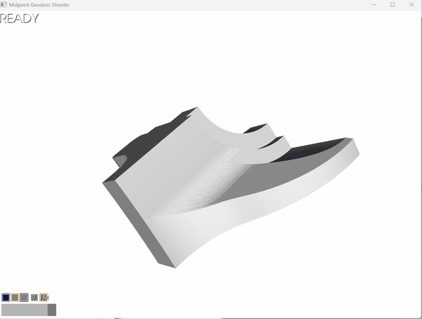

# Geodesic Spline Editor

[](https://github.com/ezacur/geodesicSplines/actions/workflows/ci.yml)
[](pyproject.toml)
[](LICENSE)

Interactive multi-spline editor for 3D triangulated meshes. Combines exact
discrete geodesic computation with cubic Bezier interpolation to produce
smooth curves that lie precisely on the surface.



## 🎯 Why this matters? (Geodesic vs. Euclidean Splines)

If you have ever tried to draw a smooth curve on a 3D scanned mesh or an
STL file using standard 3D software, you have likely encountered the
**Projection Problem**.

Most commercial 3D tools (Blender, Maya, CAD projection tools) "cheat"
when drawing curves on meshes. They compute the spline in empty 3D space
(Euclidean space) and then forcefully project it down onto the nearest
surface polygons (e.g. Shrinkwrap).

This creates severe artifacts on complex geometry:

- **The "Rubber Band" effect**: in concave areas (like the inside of a
  bowl or the folds of an ear), the curve jumps off the surface and
  floats in the air.
- **Mesh Penetration**: in convex areas (like sharp ridges), the
  Euclidean curve cuts straight through the inside of the mesh.
- **Length Distortion**: the arc-length of the projected curve is
  mathematically wrong, making it useless for precise manufacturing
  (fabric pattern cutting, CNC routing).

This editor solves the problem by computing **true discrete geodesics**.
Instead of projecting a floating curve, the engine computes the spline
intrinsically over the surface manifold. Using the **Edge-Flip Geodesic
Solver** (Sharp & Crane 2020, via [potpourri3d](https://github.com/nmwsharp/potpourri3d))
under the hood, the curve travels exactly across the faces of the
triangles.

The result:

- **Zero Penetration**: the curve behaves like a physical string wrapped
  tightly around the object. It hugs every ridge and valley of the
  underlying triangulation exactly.
- **True Arc-Length**: every segment is mathematically exact. The
  distance measured along the spline is the true distance across the
  surface.
- **Real-Time Interaction**: historically, exact geodesic math is too
  slow for interactive UIs. By combining a [local sub-mesh solver](docs/ARCHITECTURE.md#local-submesh-solver-compute_endpoint_local),
  [Numba JIT-compiled kernels](docs/ARCHITECTURE.md#numba-jit-kernels), and
  [asynchronous background workers](docs/ARCHITECTURE.md#background-workers),
  this tool brings academic-grade computational geometry into a fluid
  interactive editing experience.

**Perfect for**: reverse engineering, carbon-fiber layup paths, custom
orthotics on 3D scans, and precise fabric pattern flattening.

## Quick Start

```bash
# Install dependencies (pinned in requirements.txt)
pip install -r requirements.txt

# No argument -> opens fandisk.obj if present in the current directory,
# otherwise falls back to the in-memory icosahedron demo mesh.
# (fandisk.obj is bundled with the repo as a sample mesh — see the
#  end of this file for attribution.)
python geo_splines.py

# Open a specific mesh file (any VTK-supported format: .obj, .ply, .stl, ...)
python geo_splines.py mesh.ply
python geo_splines.py custom.obj

# Resume a saved session (loads the mesh referenced inside the JSON)
python geo_splines.py session.json

# Resume a session against a DIFFERENT mesh (e.g. inspect the same
# splines on a re-meshed / higher-resolution surface)
python geo_splines.py session.json other_mesh.ply
```

Requires Python 3.10+ (see `pyproject.toml`).
`potpourri3d` needs a C++17 compiler on first install
(MSVC 2022 Build Tools on Windows, gcc >= 9 on Linux).

The session JSON references the source mesh via the `mesh_file` field.
The string `__builtin__:icosahedron` (or the legacy plain `ICOSAHEDRON`)
is reserved for the in-memory demo mesh; any other value is treated as
a filesystem path.

## Documentation

| Document | What it covers |
|---|---|
| **[User Manual](userManual.md)** ([versión en español](manualDeUsuario.md)) | Step-by-step tutorial: your first spline in 5 steps, nodes, tangent handles, snap modifiers, sessions, export, troubleshooting, full keyboard reference |
| [docs/ARCHITECTURE.md](docs/ARCHITECTURE.md) | Internals: the spline model, the three-layer pipeline, geodesic algorithms, caches, workers, performance engineering |
| [docs/REJECTED_SUGGESTIONS.md](docs/REJECTED_SUGGESTIONS.md) | Optimisation ideas that were measured and rejected — with numbers and falsifiable re-open triggers |

New here? Read the [User Manual](userManual.md) — the
["Your first spline in 5 steps"](userManual.md#5-your-first-spline-in-5-steps)
section gets you drawing in two minutes.

## Interaction

### Mouse

| Action | Effect |
|---|---|
| Double-click Left | Add node at end of active spline, or insert at curve hover point |
| Double-click Right | On red P marker: open a coordinate-edit dialog (type `[x, y, z]` / `x, y, z` / `x y z`; live validation, Enter accepts when valid, Escape cancels). Coordinates are projected onto the closest surface point and the node is moved there via parallel transport. On empty surface: start a new spline (break). |
| Drag Red (P) | Translate node on surface (parallel transport preserves tangent) |
| Drag Blue/Green (A/B) | Adjust tangent direction and length (symmetric ray update) |
| Shift + Drag (P) | Snap drag target to the nearest mesh vertex.  A gold sphere shows the exact target while held.  Only applies to the red P marker — Shift on A / B has a different meaning (see below). |
| Shift + Drag (A / B) | **Magnitude-only mode** for the tangent: preserves direction (no rotation), the opposite handle stays symmetric (C1 continuity preserved).  The cursor is projected onto the dragged handle's tangent direction at the origin (3-D dot product); the magnitude of that projection becomes the new arc-length.  When the cursor crosses the origin (negative projection), the tangent direction flips so the handle visibly tracks the cursor.  **Vertex snap is disabled on A / B**: snapping would discretise the magnitude scalar and defeat the smooth-scrub UX. |
| Ctrl + Drag | Snap drag target to the nearest edge of the face under the cursor (perpendicular projection, clamped). Gold sphere indicator while held. |

### Keyboard

| Key | Action |
|---|---|
| C | Toggle close/open spline loop (3+ nodes). Auto-break on close. |
| Backspace | Undo last node or break |
| Ctrl+Z | Undo (snapshot-based, up to 50 levels) |
| Ctrl+Y | Redo |
| b / o / k | Toggle blue / orange / interp curve visibility |
| t | Cycle gizmo opacity (0.2, 0.4, 0.7, 1.0) |
| r | Rebuild all orange (fully geodesic) curves -- handy after layer toggles, loads, or worker crashes |
| s | Save splines to timestamped JSON (atomic UTF-8 write) |
| l | Load splines from JSON (file dialog; schema-validated) |
| v | Export orange curve to timestamped binary `.vtk` (same output as `spline_export.py --vtk --samples N` with `N = SplineConfig.EXPORT_VTK_SAMPLES`; reuses live cache when `EXPORT_VTK_SAMPLES >= GEO_SAMPLES`, otherwise recomputes).  Single-node splines are written as `VTK_VERTEX` landmarks. |
| d | Toggle the **didactic scaffold** for the active spline's last span — four dark-green auxiliary geodesic lines that visualise the de Casteljau cascade at a slider-controlled `t`.  See [the didactic scaffold](docs/ARCHITECTURE.md#didactic-scaffold-key-d) for the full geometric story. |
| Ctrl+X | Import **guide polylines** from one or more VTK-readable files (multi-select).  Only line cells are kept; polygonal cells in the same file are dropped.  Replaces any previously-loaded guides.  See [Guide Curves](docs/ARCHITECTURE.md#guide-curves-ctrlx--x). |
| x (hold) | While held, every imported guide actor jumps to **opacity 1.0** for an unmistakable preview.  On release the visibility *toggles* relative to the state captured at press time: visible → hidden, or hidden → visible with a 500 ms ease-out fade. |
| n (hold) | Show node-index labels above every node while the key is held; release to hide.  Single-spline scenes show just the 1-based node index (`3`); multi-spline scenes prefix the 1-based spline index (`s1:3`).  Labels are occlusion-aware and follow nodes being dragged. |
| e | Export geodesic paths to TXT |
| w | Toggle wireframe overlay |
| a | Cycle surface transparency |

### Checkboxes

Three colored checkboxes (bottom-left) mirror the b/o/k keys for
layer visibility.

### Logging

All HUD text and diagnostic output are in English.  Diagnostics route
through Python `logging` under the `geo_splines` logger.  Set
`GEO_SPLINES_DEBUG=1` to raise the level to `DEBUG` (worker traces,
snap diagnostics, solver fallbacks).

## Three Curve Layers

Each spline has up to three simultaneous curve representations with
increasing accuracy and computational cost
(full pipeline details in [docs/ARCHITECTURE.md](docs/ARCHITECTURE.md#three-curve-layers)):

| Layer | Key | What it is | Cost |
|---|---|---|---|
| **Blue — Bezier** | `b` | The workhorse curve.  Dual-mode: fast hybrid during drag (~3-8 ms/span), semi-geodesic on release (~25-40 ms/span, exact geodesic between the handles). | Real-time, main thread |
| **Orange — fully geodesic** | `o` | de Casteljau cascade where all three levels use exact geodesic interpolation, refined progressively (midpoint → quarters → …) and chord-bridged with exact mesh geodesics. | ~4-7 s/span, background workers (max 4) |
| **Black — interp B-spline** | `k` | Quick-and-dirty scipy B-spline through the node origins, projected onto the surface.  Immediate feedback, no geodesic awareness. | ~1-5 ms, main thread |

> **Default visibility at startup**: only the blue layer is shown —
> press `o` / `k` to toggle the others.

If a geodesic solve fails (disconnected mesh islands, degenerate
topology), the affected span is repainted **saturated red** and a HUD
warning fires — you never silently trust a phantom curve.  See
[Fallback Visualization](docs/ARCHITECTURE.md#fallback-visualization).

## Save / Load

### JSON Format (version 2 — current)

```json
{
  "version": 2,
  "mesh_file": "mesh.ply",
  "splines": [
    {
      "closed": false,
      "nodes": [
        {"id":     1,
         "origin": [x0, y0, z0],
         "p_a":    [ax0, ay0, az0],
         "p_b":    [bx0, by0, bz0]},
        {"id":     2,
         "origin": [x1, y1, z1],
         "p_a":    [ax1, ay1, az1],
         "p_b":    [bx1, by1, bz1]}
      ]
    }
  ]
}
```

Each node persists three 3-D points: ``origin`` (the node position on
the surface), ``p_a`` (handle A endpoint), and ``p_b`` (handle B
endpoint).  Either or both handle entries may be ``null`` for
placeholder single-node splines that haven't yet had tangents set up.

An optional ``id`` field (1-based, matches the labels shown by the
'n' hot-key) is emitted by the writer as a cosmetic aid for humans
skimming the file.  The loader **does not consume it** — node order
in the list defines the runtime index — so deleting, renumbering, or
omitting ``id`` entries by hand is harmless.  Legacy sessions written
before the field was introduced load unchanged.

#### Layout

The save path uses a hand-rolled formatter
(``_format_session_json``) that keeps the outer structure indented
but emits each node on **four aligned lines** (one per field,
``id`` plus the three coordinate triplets) with each 3-vector
inline.  Compared to ``json.dump(indent=2)``'s 12+ lines per node,
sessions shrink ~3× at the same readability — the colon column is
preserved across ``"id"`` / ``"origin"`` / ``"p_a"`` / ``"p_b"`` so
the values form a clean vertical stripe.  Output is plain JSON (no extensions); any standard
JSON parser round-trips it without information loss.  If the dict
shape ever drifts away from the v1/v2 schema, the formatter falls
back to ``json.dumps(indent=2)`` so we never emit malformed JSON.

On load, the editor rebuilds ``path_a`` and ``path_b`` via
``compute_endpoint_from_origin`` (the EdgeFlipGeodesicSolver) — the
**same call the editor uses during drag**.  This guarantees a
bit-for-bit round-trip: a handle dragged to a specific surface point
appears at exactly the same spot on reload.

### JSON Format (version 1 — legacy)

The original schema stored a single ``tangent`` vector per node
(direction × ``h_length``) and reconstructed both handles
symmetrically via ``compute_shoot`` ± ``tangent_dir``.  This worked
for the symmetric initial state but lost the solver-curving
information whenever a handle was dragged on a curved surface, so
reload could shift the handle ~0.1-0.2 units away from the user's
choice.  v2 was introduced to fix that.

Both versions still load.  ``_validate_session_dict`` dispatches per
node by which keys are present (``tangent`` → v1 path, ``p_a`` +
``p_b`` → v2 path), so a session file may even mix the two schemas
node-by-node.  All new saves and undo / redo snapshots are v2.

The special value ``__builtin__:icosahedron`` (or the legacy plain
``ICOSAHEDRON``) as ``mesh_file`` generates the built-in demo mesh
(12-vertex icosahedron, radius 10).

## CLI Export

```bash
python spline_export.py <file.json> <b|o|k> [--samples N] [--obj | --vtk] [--mesh PATH]
```

Loads a saved session (v1 or v2 schema) and writes the curve points
of the chosen layer to disk.  Three output formats:

| Output | Flag | Contents |
|---|---|---|
| CSV (default, stdout) | -- | One ``x, y, z`` per line.  Single ``NaN, NaN, NaN`` line breaks the polyline between splines; double ``NaN`` separates landmark records. |
| Wavefront OBJ | `--obj` | One vertex per sample, one ``f`` line per consecutive pair.  All splines concatenated into a single line strip per spline. |
| Binary legacy VTK | `--vtk` | UnstructuredGrid with ``VTK_LINE`` (cell type 3) for span samples and ``VTK_VERTEX`` (cell type 1) for single-node landmarks. |

| Layer | Flag | Typical time |
|---|---|---|
| Black (interpolation) | `k` | Seconds (fastest) |
| Blue (semi-geodesic) | `b` | Seconds |
| Orange (fully geodesic) | `o` | Seconds to minutes — spans are computed in parallel (4 worker processes).  Measured: a 3-span fandisk session at the default ``--samples 60`` exports in ~5 s wall-clock, mesh load and JIT warm-up included.  Scales with mesh density and ``--samples``. |

The editor's ``v`` shortcut shells out the same orange computation
in-process, writing a timestamped ``.vtk`` file to the working
directory — convenient for dumping the live curve without a JSON
save first.  The sample count is controlled by
``SplineConfig.EXPORT_VTK_SAMPLES`` (default 20) and the live
``_geo_span_cache`` is reused when ``EXPORT_VTK_SAMPLES >=
GEO_SAMPLES``, skipping the recompute.

## Dependencies

Pinned in [`requirements.txt`](requirements.txt):

- **PyVista** / **VTK** -- 3D visualization and interaction
- **NumPy** / **SciPy** -- Numerical computation, KDTree
- **potpourri3d** -- Edge-Flip geodesic solver (geometry-central backend)
- **Numba** (optional) -- JIT compilation of hot paths. When missing,
  `@njit` is a transparent no-op and hot paths run ~50-2000x slower.

## Files

```
geodesics.py           Geodesic algorithms + Numba kernels
gizmo.py               SegmentData + GeodesicSegment widget
geo_shoot.py           MidpointShooterApp + SurfaceCursor
geo_splines.py         GeodesicSplineApp (main application)
spline_export.py       CLI curve exporter
userManual.md          User manual (English)
manualDeUsuario.md     Manual de usuario (español)
docs/ARCHITECTURE.md   Implementation internals
docs/REJECTED_SUGGESTIONS.md  Measured optimisation rejections
tests/                 Unit tests + profiling/parity benchmark
requirements.txt       Pinned dependency versions
geodesicSplines.gif    Demo animation embedded above
fandisk.obj            Bundled sample mesh (~6.6k faces).  The
                       no-argument editor launch opens this file
                       when present in the current directory.
                       Classic "fandisk" CAD-style benchmark mesh
                       widely used in computational geometry papers
                       (e.g. Hoppe 1996, Botsch & Kobbelt).  Kept in
                       the repo so the editor has an immediately
                       usable demo without external downloads.
```

## License

This project is licensed under the [GNU General Public License v3](LICENSE).
