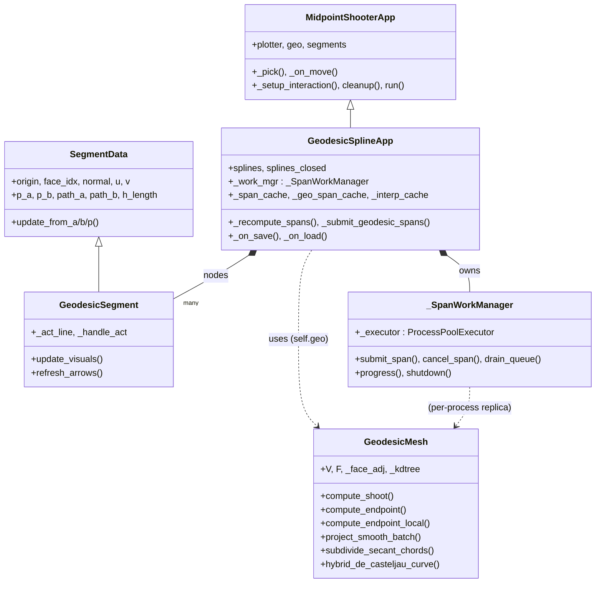
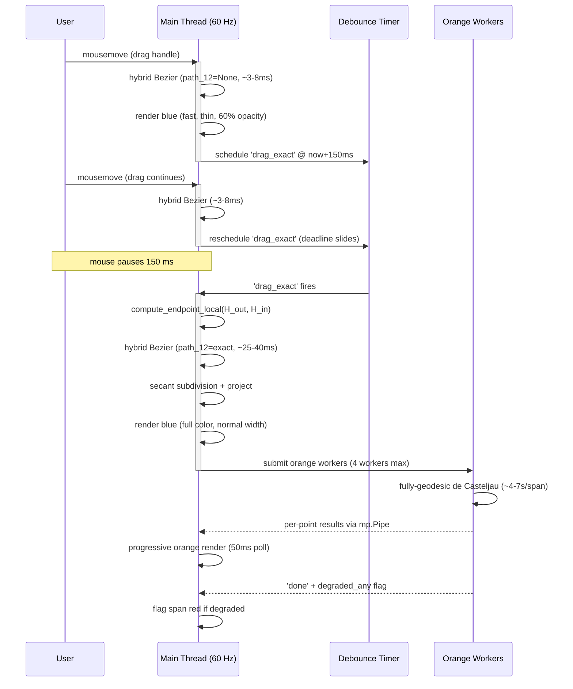

# Architecture & Internals

Implementation notes for contributors and the curious.  For an
overview and usage, start with the [README](../README.md) and the
[User Manual](../userManual.md) ([versión en español](../manualDeUsuario.md)).

Performance claims in this document are measured, not estimated —
the profiling / parity tooling lives in
[`tests/benchmark_endpoint_local.py`](../tests/benchmark_endpoint_local.py),
and optimisation ideas that were tried and rejected are recorded with
their measurements in [REJECTED_SUGGESTIONS.md](REJECTED_SUGGESTIONS.md).

## Contents

- [Module Layout](#module-layout)
- [The Spline Model](#the-spline-model)
- [Three Curve Layers](#three-curve-layers)
- [Geodesic Algorithms](#geodesic-algorithms)
- [Snap to Vertex / Edge](#snap-to-vertex--edge-shift--ctrl-modifier)
- [Guide Curves](#guide-curves-ctrlx--x)
- [Fallback Visualization](#fallback-visualization)
- [SSAO (experimental)](#ssao-experimental)
- [Morton (Z-order) Mesh Layout](#morton-z-order-mesh-layout)
- [Master Clock and Debounce](#master-clock-and-debounce)
- [Curve Hover Detection](#curve-hover-detection)
- [Data / Rendering Separation](#data--rendering-separation)
- [Normal Smoothing](#normal-smoothing)
- [Node Insertion](#node-insertion)
- [Drag Visual Feedback](#drag-visual-feedback)
- [Undo / Redo](#undo--redo)
- [Performance](#performance)

## Module Layout

The system is split into five modules with clear responsibilities:

| Module | Role |
|---|---|
| `geodesics.py` | Geodesic algorithms: shooting, endpoint solving, topology insertion, surface projection, Numba JIT kernels |
| `gizmo.py` | `SegmentData` (pure geometry) + `GeodesicSegment` (VTK rendering) for interactive ray-pair widgets |
| `geo_shoot.py` | `MidpointShooterApp` base app: plotter, picking, cursor, debounce timer, drag lifecycle |
| `geo_splines.py` | `GeodesicSplineApp`: multi-node splines, three curve layers, background workers, save/load, CLI |
| `spline_export.py` | Command-line curve exporter (CSV / OBJ / VTK) |

### Class diagram



## The Spline Model

Each spline is a chain of nodes. Between consecutive nodes, a **span** is
drawn as a cubic Bezier curve through four control points:

```
[node_i.origin,  node_i.p_b,  node_{i+1}.p_a,  node_{i+1}.origin]
```

The handles `p_a` and `p_b` are geodesic endpoints computed by shooting
symmetric rays from the node origin. They lie exactly on the surface with
known geodesic paths connecting them to their node.

### C1 Continuity

Every node enforces C1 continuity: handles `p_a` and `p_b` depart in
exactly opposite tangent-plane directions with equal arc-lengths. When
the user drags one handle, the opposite is recomputed automatically to
maintain symmetry.

### Closed Loops

Pressing C on a 3+ node spline closes the loop by computing a
closing tangent on the first node (`p_a` toward the last node) and
adding a wrap-around span.

## Three Curve Layers

Each spline has up to three simultaneous curve representations with
increasing accuracy and computational cost.

> **Default visibility at startup**: only the blue layer is shown.
> Orange (`'o'`) and interp (`'k'`) start hidden — orange because it is
> heavy to compute (the background workers run regardless of visibility,
> so toggling on shows whatever is already done) and interp because it
> is purely a B-spline through node origins, useful but rarely the
> primary signal.  Press the corresponding key to toggle.

### Blue -- Bezier (dual-mode)

The workhorse curve — always visible, accurate.  Dual-mode:

- **During drag** (~3-8 ms per span): fast hybrid.  Level-1 geodesic
  lerp on the two outer paths (`path_b`, `path_a`), Euclidean lerp +
  projection on H_out→H_in.  Levels 2-3 Euclidean + projection.  The
  expensive `compute_endpoint_local` call is *skipped* during drag —
  that is what makes the preview cheap, not the sample count, so blue
  uses the same density as the resting curve and the polyline is
  visually smooth even mid-gesture.
- **On consolidation** (debounce fires, ~25-40 ms per span):
  semi-geodesic.  `compute_endpoint_local` provides an exact geodesic
  `path_12` between H_out and H_in, so level-1 is fully geodesic.
  Levels 2-3 remain Euclidean + projection.  Cost is dominated by the
  solver call (~25 ms) rather than the de Casteljau levels.

This dual-mode keeps interactive drag fluid while snapping to accurate
geometry the moment the user stops moving.  Computed synchronously in
the main thread inside `_recompute_spans` — no background worker.

#### Dual-mode Timeline




### Orange -- Fully Geodesic de Casteljau (~4-7 s per span)

- All three de Casteljau levels use geodesic interpolation.
- ~4 `compute_endpoint_local` calls per sample point (submesh solver,
  ~6x faster than global; all intermediate de Casteljau points are
  close enough that the local submesh almost never fails).
- Computed in background processes (max 4).
- `GEO_SAMPLES = 33` (= 2^5 + 1) — 5 clean binary-subdivision levels.
- **Progressive hierarchical refinement**: the worker computes points
  in midpoint → quarter → eighth → ... order (not t=0 to t=1).  The
  main thread maintains a t-sorted buffer pre-seeded with the
  two node origins, so the curve is visible from submission-time as
  a 2-point stub that **refines in detail** rather than growing from
  one end.  User sees the overall shape in ~150 ms instead of waiting
  several seconds for a snake to traverse the span.

#### Three-phase worker pipeline

After Phase 1 (the canonical 33 samples) the worker runs two extra
phases so the rendered orange polyline matches the underlying cascade
mathematically — fixing the historical "orange polyline drifts away
from the didactic point" mismatch that the legacy
`subdivide_secant_chords` post-pass produced (it inserted points
projected to the surface, not points on the cascade).

| Phase | Purpose | Output |
|---|---|---|
| **1 — Canonical samples** | Evaluate the de Casteljau cascade at the 33 grid t-values, hierarchical order. | `('point', span_key, t, point)` per sample. |
| **2 — Cascade densification** | For every consecutive sample pair whose chord deviates from the true curve beyond `ORANGE_SUBDIV_TOL_FACTOR × mean_edge`, insert a fresh cascade evaluation at the midpoint t. Recursive up to `ORANGE_SUBDIV_MAX_DEPTH`. Each insertion is sent immediately, so the curve refines progressively in problem regions. | More `('point', span_key, t, point)` messages, t-sorted on the parent via bisect. |
| **3 — Geodesic chord-bridging** | Connect every consecutive sample pair with an exact mesh geodesic via `short_geodesic` (fast path: adjacent triangles, ~5 µs) or `compute_endpoint_local` (fallback, ~25 ms). Result polyline hugs the surface even between samples — no straight 3-D chords cutting through ridges. | One `('chord_geo', span_key, polyline)` message; replaces the t-sorted chord polyline as the rendering source. |

The three phases map 1:1 to the worker helpers in `geo_splines.py`:
`_phase1_canonical`, `_phase2_densify`, `_phase3_chord_bridge`,
orchestrated by `_geodesic_decasteljau_worker`.

Two deviation criteria for Phase 2 (selectable via
`SplineConfig.ORANGE_DEVIATION_MODE`):

| Mode | Cost per pair | Decision rule |
|---|---|---|
| `'cascade'` (default) | One full cascade evaluation per pair (~75 ms) | Split if `‖chord_midpoint − cascade_eval(t_mid)‖ > tol` — measures deviation from the *true* curve.  Always pays the cascade cost even on pairs that won't split. |
| `'surface'` | One batched `project_smooth_batch` call (~µs per pair) + cascade evaluation only on pairs flagged for splitting | Split if `‖chord_midpoint − project(chord_midpoint)‖ > tol` — only catches mesh-piercing chords, but cheap.  Inserted point is still the cascade evaluation, so geometric quality is identical between modes; only the *decision* of whether to split differs. |

`'cascade'` is the honest metric (the curve is the truth) and is the
default.  `'surface'` exists as a faster fallback for users with
many splines on dense meshes who find `'cascade'` too slow.  Disable
chord-bridging entirely with `ORANGE_CHORD_BRIDGING = False` if you
want straight chords between samples (rarely useful, kept as an
escape hatch).

#### `short_geodesic` — fast path for adjacent triangles

Phase 3 connects ~30-100 sample pairs per span by exact geodesic.
Calling `compute_endpoint_local` (~25 ms) for every pair would dominate
the worker's cost.  `GeodesicMesh.short_geodesic` is a fast specialised
path that handles two cases without invoking the edge-flip solver:

- **Same triangle** → straight 3-D segment (the triangle is flat,
  geodesic is the chord).  Returns `[p0, p1]`.
- **Adjacent triangles (sharing an edge)** → unfold both faces into a
  common plane around the shared edge, find the optimal crossing via
  the classic mirror reflection trick, validate that the crossing
  falls strictly inside the shared edge with margin
  `max(1e-7, 0.001 × edge_length)`.  Returns `[p0, q, p1]` in ~5 µs.
- **Anything else** (non-adjacent faces, vertex-only adjacency,
  degenerate edge, crossing on/near a shared-edge vertex) → returns
  `None`; the worker falls back to `compute_endpoint_local`.

The validation margin is critical: a crossing that lands on a shared-
edge vertex means the optimal geodesic actually wraps around the
vertex's curvature cone — the flat unfolding is not valid in that
case, and the result would be wrong.  Bouncing to the full solver
preserves correctness.

#### Reuse for VTK export (key `v`)

The cached orange polyline (post-phase-3) is the rendering source of
truth.  When `EXPORT_VTK_SAMPLES >= GEO_SAMPLES` and no workers are
in flight, the `v` key reuses those polylines verbatim — the export
is bit-for-bit identical to what is on screen, with no recomputation.
Lower export sample counts trigger a fresh `compute_orange` with no
densification (useful for ultra-light exports of coarse landmark
curves; the CLI `spline_export.py` does the same).

#### Progress feedback

The orange layer has two visual signals that it is still computing:

- **Dimmer color** (`GEO_COLOR_COMPUTING`, `#b85a00`) while the worker
  is active; switches to full orange (`GEO_COLOR`, `#ff8800`) on the
  'done' message.  Clear binary "working / done" indicator.
- **Dashed polyline** (optional, `GEO_DASHED_WHILE_COMPUTING = True`):
  during computation, only the odd 1-indexed segments of the polyline
  are rendered, producing a visible dashing pattern that densifies as
  more points arrive.  Consolidation switches back to a solid
  polyline.  Disable the flag for a solid-dimmer look without dashes.

Degraded spans (geodesic fell back to a straight line) are painted
`SPAN_FALLBACK_COLOR` regardless of the computing state — a failure
signal dominates any progress indicator.

#### Didactic scaffold (key `d`)

A toggleable visualisation of the de Casteljau cascade for the
active spline's **last span** at a slider-controlled parameter `t`
(default `0.5`, range `[0, 1]`).  Useful for teaching, debugging, or
just understanding what the orange curve is doing under the hood.

A horizontal slider appears in the bottom-left when the scaffold is
toggled on; dragging it sweeps `t` across the span and the four
auxiliary lines reshape live (each tick re-runs the four
``compute_endpoint_local`` calls, ~75-125 ms — feels live on modern
hardware).  When the scaffold is toggled off the slider is disabled
along with the lines.  Toggling it back on remembers the last `t`.

Pressing `d` draws four dark-green geodesic auxiliary lines:

| Line | Endpoints | Stage of the cascade |
|---|---|---|
| `path_12`    | `H_out ↔ H_in`   | Level 1: middle segment between the two handles. |
| `path_c0`    | `b01 ↔ b12`      | Level 2: first chord between consecutive level-1 midpoints. |
| `path_c1`    | `b12 ↔ b23`      | Level 2: second chord. |
| `path_final` | `c0 ↔ c1`        | Level 3: collapses to the orange curve sample at the chosen `t`.  A small dark-green sphere is rendered at `geodesic_lerp(path_final, t)` so the collapse point is visually unambiguous — by construction it lies exactly on the orange curve. |

The intermediate points (`b01`, `b12`, `b23`, `c0`, `c1`) on levels
1-2 are computed via geodesic_lerp on the level-N paths but not
drawn as markers — only the level-3 collapse point gets its own
sphere, since that is what the cascade is converging to.

"Last span" means:
- **Open spline** of N nodes: span between `nodes[N-2]` and `nodes[N-1]`.
- **Closed spline**: the wrap-around span between `nodes[N-1]` and `nodes[0]`.
- Active spline with **<2 nodes**: a brief HUD message
  (`DIDACTIC: no last span`) and nothing is drawn.

**Refresh policy**:

| State | Cost | Method |
|---|---|---|
| Invisible | 0 | Skipped entirely |
| Toggled on | ~75-125 ms | ``_compute_didactic(fast=False)`` — exact geodesics via ``compute_endpoint_local`` |
| Slider drag | ~75-125 ms / tick | ``_compute_didactic(fast=False)`` — exact geodesics |
| Node drag | ~5-10 ms / frame | ``_compute_didactic(fast=True)`` — Euclidean line + ``project_smooth_batch`` (same trick blue uses for ``path_12`` during drag) |
| Drag release | ~75-125 ms | ``_compute_didactic(fast=False)`` — re-renders with exact geodesic; the visible snap from approximation to exact is itself didactic |

Opacity tracks the global handle opacity (cycled with `t`), so the
scaffold fades together with the node markers and tangent arrows.

### Black -- Interpolation B-spline (immediate)

**Philosophy: fast and rough.** This is a quick-and-dirty curve that
gives immediate visual feedback of the overall spline shape. It has no
geodesic awareness — it is a pure 3D B-spline projected onto the
surface after the fact. The trade-off is speed over accuracy: a new
AI or developer reading this code should understand that this layer
exists for responsiveness, not for geometric correctness.

- Scipy `splprep`/`splev` B-spline interpolating the node origins.
- NOT a Bezier: no handles, no de Casteljau — purely node-defined.
- Degree: `min(3, n_nodes - 1)`. Closed splines use `per=True`.
- Projected onto the surface via `project_smooth_batch`.
- **Dedicated secant subdivision** with tighter parameters than Bezier
  layers, because the 3D B-spline can deviate further from the surface:
  - `INTERP_MIN_SAMPLES = 200` (high base count for short chords)
  - `INTERP_SECANT_TOL_FACTOR = 0.002` (5x tighter than Bezier's 0.01)
  - `INTERP_SECANT_MAX_DEPTH = 8` (256x local refinement)
- Cost: ~1-5 ms.  Computed synchronously on the main thread.
  **Visibility-gated**: while the layer is hidden (the default at startup),
  `_recompute_interp_curve` is short-circuited so the splprep / splev /
  project chain does not steal frames from the visible layers during
  drag.  On the OFF→ON transition `_toggle_layer` triggers a one-shot
  recompute across all splines so the curve appears immediately at full
  quality.  Unlike orange (which always computes via background workers),
  interp must run on the main thread, so the gating matters.
- Toggle: key `k`. Z-depth -6 (behind all Bezier layers).
- Cache: `_interp_cache` keyed by spline index (one curve per spline,
  not per span like the Bezier layers).

### Visual Z-Order

Layers are stacked with increasing depth priority:

| Layer | Depth offset | Visual position |
|---|---|---|
| Black (interpolation) | -6 | Far back |
| Blue (Bezier) | -8 | Middle |
| Orange (fully geodesic) | -20 | Front |

## Geodesic Algorithms

### Shooting -- The Unrolling Algorithm (`compute_shoot`)

Traces a geodesic ray from a point in a given tangent direction for a
prescribed arc-length. A geodesic on a triangle mesh is a straight line
within each face that changes direction only at edge crossings. The
algorithm "unrolls" adjacent triangles into a common plane -- the ray
travels straight, and only the mesh topology causes direction changes.

The inner loop (7 phases per edge crossing):

1. **Project direction** onto the face tangent plane (remove normal
   component, renormalize).
2. **Ray-edge intersection** (`_ray_edge_jit`): intersect the ray with
   all 3 edges of the current triangle. Uses the determinant form
   `(d x edge) . n` with three numerical thresholds:
   - `det_tol = 1e-10 * edge_len^2` -- scale-invariant parallelism test.
   - `s_tol = 1e-4` -- edge parametric bounds with clamping.
   - `t_min = -1e-8` -- accepts intersections at the current position
     (after the 1e-7 nudge from the previous step).
3. **Arc-length check**: if remaining distance fits within the face,
   place the final point via linear interpolation and stop.
4. **Record edge crossing** in the pre-allocated path buffer, advance
   remaining arc-length.
5. **Cross to adjacent face** via `_face_adj[fi, edge_i]` -- an (M, 3)
   int32 matrix giving O(1) neighbor lookup. Built once at init via
   vectorized edge-key sorting (no Python loops over faces).
6. **Parallel transport** the direction vector across the shared edge.
   Decomposes the vector into components parallel and perpendicular to
   the edge, rotates the perpendicular component through the dihedral
   angle, reassembles. Fully inlined scalar math (no numpy calls).
   When `fast_mode=True` (preview/crosshair), a cheaper re-projection
   replaces the full transport.
7. **Nudge** the current position 1e-7 past the edge boundary to prevent
   the next iteration from re-intersecting the same edge.

**Vertex/edge fallback** (Phase 2b): when ray-edge intersection fails
(degenerate triangle, all determinants near-zero), the algorithm finds
the nearest vertex of the current face, iterates its adjacent faces via
the CSR arrays `(vf_data, vf_offsets)`, projects the direction onto each
candidate face's tangent plane, and picks the best continuation. This
replaces the KDTree.query that the original Python version used -- the
JIT kernel cannot call scipy, but the local vertex search is sufficient
because the failure case always occurs at a vertex/edge boundary.

The entire loop is compiled to native code via
`@njit(cache=True, fastmath=True)`.

### Endpoint Solving (`compute_endpoint`)

Finds the shortest geodesic between two arbitrary surface points using
the Edge-Flip algorithm (potpourri3d / geometry-central):

1. Create working copies of V and F arrays (pre-allocated buffers,
   oversized by a few slots to avoid per-call allocation of 120K
   vertices).
2. Insert both endpoints into the mesh topology via **1-to-3 face
   subdivision**. Points near edges (barycentric coord < 1e-3) are
   nudged ~1% of the shortest edge length toward the face centroid
   (clamped to [1e-6, 1e-2]) to prevent sliver triangles with
   near-zero area. A post-subdivision area check verifies all
   sub-triangles; if any is degenerate, the insertion falls back
   to vertex snap.
3. **Remove degenerate faces** (self-edges) from the modified topology
   via a vectorized check `F[:,0] != F[:,1]` etc.
4. Build an `EdgeFlipGeodesicSolver` on the modified mesh.
5. Extract the geodesic path between the two inserted vertices.

**Connected component check**: before any of the above, the method
verifies that both endpoints lie on the same connected component of
the mesh (via pre-computed face labels from BFS on the face adjacency
graph). If they are on disconnected components (islands), a
straight-line fallback `[p_start, p_end]` is returned immediately --
no solver invocation, no silent garbage.

If the solver rejects the mesh, the insertion is **retried** with both
points nudged toward their face centroids (nudge fraction relative to
the shortest edge, same clamping as above). Only if the retry also
fails, falls back to vertex-snapped geodesic via the pre-built solver.

### Short Geodesic (`short_geodesic`)

When two points lie in the same triangle or in two edge-adjacent
triangles, the geodesic between them is either a straight 3-D segment
(same triangle, since the triangle is flat) or a unique two-segment
polyline through one specific point on the shared edge (adjacent
triangles).  No edge-flip iteration, no submesh extraction, no solver
invocation — just a 2-D mirror-reflection construction in the plane of
the unfolded triangle pair (~5 µs).

This is the fast path used by the orange worker's phase-3 chord-
bridging.  After the cascade has produced ~30-100 t-sorted samples
along a span, consecutive samples are typically very close on the
mesh and frequently land in adjacent triangles (or the same one),
so `short_geodesic` succeeds for the majority of pairs and the
worker only pays the full `compute_endpoint_local` cost (~25 ms) on
the few pairs that span more than two triangles or wrap around a
vertex.

The validation step is the load-bearing part of the contract: if the
optimal crossing falls within `max(1e-7, 0.001 × edge_length)` of
either shared-edge vertex, `short_geodesic` returns `None` and the
caller falls back.  A near-vertex crossing means the true optimal
geodesic actually wraps around the vertex's cone of curvature — the
flat-plane unfolding is no longer valid there, so the result would
be wrong.

### Local Submesh Solver (`compute_endpoint_local`)

`compute_endpoint_local` is the workhorse geodesic solver for all
interactive paths in the app.  Instead of building the
`EdgeFlipGeodesicSolver` on the full mesh (~250-350 ms on a 240K-face
mesh), it constructs the solver on a small submesh extracted around
the two endpoints (~5-25 ms).

**Used by:**

- **Blue layer consolidation** (`_recompute_spans`): when the debounce
  fires, the blue Bezier is upgraded from fast hybrid to semi-geodesic
  by passing the exact `path_12` to `hybrid_de_casteljau_curve`.
- **Orange layer** (`_geodesic_decasteljau_worker`): all 4 geodesic
  calls per sample point (level-1 path_12 + 3 de Casteljau levels).
- **Handle drag** (`compute_endpoint_from_origin`): when a user drags
  a handle A or B, the debounce-consolidated geodesic from node origin
  to the new handle position (~40× faster than global solver).
- **CLI export** (`spline_export.py`): all geodesic calculations for
  blue and orange curves.

#### Submesh Subdivision (kwarg `submesh_subdiv`, default 0)

`compute_endpoint_local` accepts an optional `submesh_subdiv=N`
that runs **N rounds of 1-to-4 Loop subdivision** on the extracted
submesh BEFORE the solver constructs.  Each round multiplies the
face count by 4.

**Why this exists.**  `EdgeFlipGeodesicSolver` (Sharp & Crane 2020)
is exact in the discrete-geodesic sense: it returns the shortest
path along edges of the **input** triangulation.  On a coarse
mesh, "shortest path along edges" can differ noticeably from the
geodesic of the underlying smooth surface — and worse, between
two cascade samples the discrete geodesic can flip-flop between
two near-equal-length edge chains, producing visible kinks
(~cm-scale jumps) in the rendered orange curve.

Subdividing the submesh once gives the solver finer edges to work
with: the discrete geodesic converges to the smooth-surface
geodesic, the flip-flop disappears, and consecutive cascade
samples vary continuously.  Verified empirically on fandisk: a
4.5 cm jump between two samples drops to **0.5 mm** at level 1.
Level 2 gives the same answer (already converged) at higher cost,
sometimes triggers solver degeneracy, and is not recommended.

**Cost.**  ~4× per level (a 25 ms call → ~100 ms at level 1).
The orange worker runs in background processes so this does not
block the UI; the visible curve just appears a few seconds later.

**Used by.**  `ORANGE_SUBMESH_SUBDIV = 1` in `SplineConfig` (default)
threads `submesh_subdiv=1` through every `compute_endpoint_local`
call inside the orange worker AND the didactic scaffold (so the
collapse point still lands exactly on the rendered curve).  Blue
consolidation and handle drag stay at `submesh_subdiv=0` for
latency.

#### Projected-Line Pre-filter

The submesh seed is the **projection of the straight euclidean line
A→B onto the mesh surface**:

1. Sample `[A, B]` with 100 points in 3D (euclidean linspace).
2. `project_smooth_batch_with_faces` projects each sample onto its
   closest triangle and returns the face index.  Vectorised Numba
   kernel (~500 µs for 100 points on a 250K-face mesh).
3. The set of hit faces forms a **narrow tube that follows the real
   terrain**: on a ridge, the tube climbs and descends with the surface;
   in flat regions, it is a straight strip.
4. Belt-and-suspenders: the 1-ring of the endpoint faces
   (`_faces_for_point`) is union-merged into the seed so that the
   topology insertion can never miss the origin/target face.

Why this beats a spherical / bounding-box filter:

- **Ridges and valleys**: a sphere centred on the euclidean midpoint
  cuts through the mountain — the solver then has to reach around,
  often triggering the boundary-check fallback.  The projected line
  already includes the ridge faces because that is where the straight
  line *is*, projected.
- **Tight tube**: typically captures ~100-300 faces vs ~500-2000 for
  the sphere, so the `EdgeFlipGeodesicSolver` construction is faster.
- **Scales to any topology**: no assumptions about where the geodesic
  "should" be — the projection finds it automatically.

#### Three-phase fallback

When phase A's tight 3-ring submesh fails (boundary touch or solver
exception), the search escalates through two more phases.  Each
phase reuses the BFS state of the previous one, so depth N costs
"N rings of advance" rather than "restart from the seed":

| Phase | Strategy | Submesh size (typ.) | Use case |
|---|---|---|---|
| **A** | Euclidean tube + 3 rings | seed + 3 rings (tight) | Convex / mildly-curved geometry — the common case |
| **B** | Dijkstra corridor + 3 rings | corridor + 3 rings | U-shape / horseshoe where the Euclidean line projects onto the wrong wall |
| **C** | BFS expansion 15 → 30 → 60 rings | progressively wider | Pathological cases where neither A nor B converges |

Phase B is activated only when phase A returns `'boundary'` or
`'error'`.  It runs scipy's C-coded
[`scipy.sparse.csgraph.dijkstra`](https://docs.scipy.org/doc/scipy/reference/generated/scipy.sparse.csgraph.dijkstra.html)
on the **face dual graph** (nodes = faces, edge weights =
centroid-to-centroid distance).  Backtracing from the end face to
the start face yields a topological corridor that respects surface
topology — even when the Euclidean shortcut goes through air.  The
graph is built lazily on first miss (typical session never pays the
~5-50 ms construction cost).

Each phase costs ~5-25 ms (rebuild submesh + solver); the rare
phase-B Dijkstra adds ~10-50 ms once.  Compared to the ~300 ms
global solver, this turns what would otherwise be a 300 ms stutter
into a 30-90 ms blip on extreme concave geometry.

#### Pipeline summary

1. Project line A→B onto mesh → seed face set.
2. **Phase A**: BFS expand seed by 3 rings.
3. Extract submesh (V_sub, F_sub, vertex remap).
4. Identify submesh boundary faces (for the post-solve check).
5. Topology insertion: query the **global** KDTree, translate to
   submesh-local via `np.searchsorted(vmap, ...)` (O(log N)).  If the
   global nearest is not in the submesh, local KDTree fallback for
   that point only.  Then `_add_point_local` does 1-to-3 subdivision.
6. Build local `EdgeFlipGeodesicSolver`, solve.
7. Boundary check: any path point on a submesh boundary face → escalate.
8. **Phase B (Dijkstra)** on `'boundary'` / `'error'`: build (lazy)
   face dual graph, find shortest face-to-face path A→B by
   centroid distance, union the corridor + 3-ring expansion with
   the existing visited set, retry solve.
9. **Phase C**: progressive BFS expansion (15 / 30 / 60 rings) over
   whichever set phases A and B left in `visited` / `frontier`.
10. Exhausted retries → global fallback (`compute_endpoint`).

Correctness is never compromised: all failure paths end in the exact
global solver.  A `trivial` result (endpoints collapsed to one
vertex after insertion) is accepted as a valid 2-point stub.

### KDTree

A `scipy.spatial.KDTree` is built once from the mesh vertices at init
and reused for all spatial queries that don't require the VTK locator:

- **Surface projection** (`project_smooth_batch`): batch query with
  `k=7` to find the 7 nearest vertices per point. The wide
  neighborhood covers sliver triangles and irregular meshes where
  the correct face is attached to a vertex that is not among the 3
  closest.
- **Face lookup** (`find_face`): when the VTK locator returns an
  inconsistent (point, face) pair, falls back to KDTree nearest-vertex
  + barycentric scoring across adjacent faces.
- **Vertex snap** in topology insertion: when a point falls within 1e-4
  of a vertex in barycentric coordinates, snaps to that vertex instead
  of subdividing.
- **Stitch preview**: two-tier pipeline driven by the cursor.
  - *Fast path* (~0.01 ms, every mouse-move that crosses
    `STITCH_SKIP_PX`): vertex-snapped geodesic via the pre-built solver
    (`_solver.find_geodesic_path(idx_s, idx_e)`), using KDTree to find
    the nearest vertex indices.
  - *Exact refinement* (~25 ms, fires once the cursor has been still for
    `STITCH_EXACT_DEBOUNCE_SEC` ≈ 150 ms): replaces the snapped endpoint
    with a topology-inserted endpoint at the exact cursor position via
    `compute_endpoint_from_origin`.  Scheduled on every mouse-move
    (independently of the 3-px fast-path gate) so a sub-pixel twitch
    still resets the timer.  Defensive checks abort the refinement if
    spline state has changed since scheduling, so the fast line stays
    on screen unchanged.

The KDTree is NOT used in the Numba JIT shooting kernel (scipy objects
are opaque to Numba). The fallback path in `_shoot_loop` uses a local
vertex search instead.

### VTK Locator and Robustness

A single `vtkStaticCellLocator` is built once at init and used for all
surface queries that need O(log N) ray-mesh intersection:

- **`_pick()`**: screen-to-surface ray pick via `IntersectWithLine`.
- **`find_face()`**: closest-point projection via `FindClosestPoint`.
- **`project_to_surface()`**: single-point projection.

**Known issue**: `vtkStaticCellLocator` occasionally returns inconsistent
(point, face_id) pairs on irregular meshes -- the intersection point does
not lie on the reported face (barycentric coords wildly outside [0, 1]).

**Three-level defense in `_pick()`**:

1. `IntersectWithLine` -- fast ray pick, O(log N).
2. Barycentric validation -- if `min(u,v,w) < -0.1` or `max > 1.1`, the
   face is wrong. Fall through to:
3. `find_face()` which tries `FindClosestPoint`; if that also fails
   validation, uses KDTree nearest-vertex + barycentric scoring across
   all adjacent faces.

The same validation is applied in `compute_shoot` before the first ray
step, as a second line of defense.

**Topology insertion robustness**: `_find_face_buf` unconditionally
includes all faces created by prior insertions (not just those adjacent
to the nearest original vertex).

### Topology insertion: 2-to-4 edge split + 1-to-3 interior split

Two distinct subdivision operations are used to insert a new point
into the mesh topology, picked by where the point lies:

| Strategy | When | Effect |
|---|---|---|
| **Snap-to-vertex** | bary coord `> 1 − 1e−7` (point essentially ON a mesh vertex) | Reuse the existing vertex; no insertion. |
| **2-to-4 edge split** | bary coord `< 1e−3` AND adjacency available (point on / very near an edge) | Find the neighbour triangle across the shared edge; split BOTH triangles into 2 sub-faces each. The new vertex `p` is placed at its **exact requested position** — no nudge, no projection. Manifold by construction (4 well-formed sub-faces, no slivers). |
| **1-to-3 interior split** | otherwise (point strictly inside a triangle) | Subdivide the containing triangle into 3 sub-faces meeting at `p`. Standard barycentric subdivision. |

The 2-to-4 path is the load-bearing fix for **smooth orange / didactic
agreement on dense meshes**.  Without it, a point sweeping continuously
across an edge (as the cascade's `t` parameter varies) would trip the
old "nudge inward toward centroid" workaround at `edge_eps = 1e−3` and
produce a discrete ~1e−4 jump in the inserted-vertex position — which
then propagated through three cascade levels into ~3e−5 jitter on the
final curve.  The 2-to-4 split has no such discontinuity: as the point
slides along the edge, the inserted vertex slides along it
continuously, and the topology change happens once when the point first
crosses INTO the triangle (not every time it grazes the edge).

The fallback nudge at `nudge_eps = 1e−7` is kept as a last resort for
the rare case where the 2-to-4 cannot apply: boundary edges of the
submesh (no neighbour to split with) or inconsistent adjacency.  When
it fires, the 1-to-3 path's post-subdivision area check
(`area < 1e−15 → snap to nearest vertex`) catches any remaining
degenerate sub-face.

Adjacency is maintained via a per-call `adj_buf` matrix, built once
from `self._face_adj` (global path) or from the submesh's `F_sub`
(local path) and updated in lockstep with `F_buf` after every
insertion.  See `_split_edge_2to4`'s docstring for the bookkeeping
details (4 modified/new face entries + up to 4 outer-neighbour re-routes).

### Surface Projection (`project_smooth_batch`)

Batch-projects points onto the nearest triangle surface. Two-phase
approach:

1. **KDTree query** (scipy C, single call): find `k=7` nearest
   vertices for each point. The wider neighborhood is robust on
   sliver triangles and irregular meshes where the correct face is
   attached to a vertex that is not among the 3 closest — a common
   failure on scan data. Extra cost is negligible (the candidate
   face set is deduped before the JIT projection).
2. **Analytical projection** (Numba JIT kernel): for each candidate face
   adjacent to any of the 3 nearest vertices, project the point onto
   the face plane, compute barycentric coordinates, clamp to triangle,
   measure squared distance. Return the closest result.

The JIT kernel operates on pre-indexed face geometry arrays
(`_face_verts`, `_face_normals`) with fully inlined scalar math -- no
numpy calls, no per-point object creation.

### Secant Chord Subdivision (`subdivide_secant_chords`)

Even after batch projection, consecutive polyline points that sit on
opposite sides of a mesh ridge (a crease with small dihedral angle)
produce a straight chord that passes *through* the mesh interior --
the line visually disappears behind the surface.

`subdivide_secant_chords` is a post-projection pass that detects and
fixes these artifacts.  Implemented as **level-synchronous batched
processing**:

1. At each iteration, compute ALL chord midpoints of the current
   polyline at once (NumPy vectorized).
2. Project all midpoints together via `project_smooth_batch`
   (single JIT-compiled call, no Python↔VTK round-trips per segment).
3. Compute per-segment deviation; mark segments where
   `|M' - M| > tol`.
4. Rebuild the polyline by interleaving originals with selected
   midpoints (vectorized, no Python loop over segments).
5. Repeat for up to `max_depth=6` iterations or until no segment
   needs subdivision.

This is ~5-10x faster than the per-segment approach because the
expensive surface projection runs in one batch per depth level rather
than once per segment.

The tolerance defaults to ~1% of the mean edge length -- adaptive to
mesh density. Segments that pass the test don't trigger any further
work on subsequent iterations.

Applied to the **blue consolidated** Bezier curve and the **black
interpolation** B-spline; skipped during drag for performance.

Note: the orange curve no longer uses this pass.  It used to, but
the inserted points (chord midpoint projections) are not on the
de Casteljau cascade, so the rendered orange polyline drifted from
the underlying mathematics — visible as a mismatch with the
didactic point at non-grid `t` values.  The orange worker now does
its own *cascade densification + geodesic chord-bridging* (see the
"Three-phase worker pipeline" section above), which keeps the
rendered curve faithful to the cascade by construction.

## Snap to Vertex / Edge (Shift / Ctrl modifier)

Holding **Shift** while dragging any marker (P / A / B) snaps the drag
target to the nearest mesh vertex in real time.  Implementation: the
per-frame ray-pick result is replaced by `self.geo.V[kdtree.query(q)]`
before the parent's drag processing sees it — one KDTree query
(~microseconds) per drag frame.  The HUD reports `SNAP -> vertex N`
to confirm.

Holding **Ctrl** during drag snaps to the nearest **edge** of the face
currently under the cursor.  For each of the 3 edges, computes the
perpendicular foot of the pick point clamped to `t ∈ [0, 1]`, then
picks the closest one.  Cheap (3 dot products + 3 comparisons per
frame) and guaranteed on-surface (every edge is a real mesh edge).
The HUD reports `SNAP -> edge va-vb t=0.42`.

Shift takes precedence over Ctrl when both are held — vertex snap is
a strict subset of edge snap (vertices are the `t=0` / `t=1` clamps).

Useful when the spline must land exactly on a topological landmark
(corner, seam, feature crease) rather than in the middle of a face.

## Guide Curves (Ctrl+X / X)

Reference polylines imported from external VTK files to assist
spline placement (e.g. anatomical landmarks scanned separately,
isophote curves computed offline, blueprint annotations).

**Loading** (`Ctrl+X`): opens a multi-select file dialog filtered to
`.vtk .vtp .ply .stl .obj`.  Each selected file becomes one rendered
actor.  The dialog **replaces** any previously-loaded guides — there
is no "append" shortcut; re-importing is the way to swap in a
different set.

**Filtering**: PyVista's reader accepts files that contain both
polygonal and line cells (e.g. a triangulated surface with a few
annotation polylines).  To keep the rendering focused, only
`points + lines` are copied to the actor; polygonal cells are
silently dropped.  A file with zero line cells is reported as a HUD
error and skipped, but the rest of the multi-select batch still
loads.

**Container handling**: `pv.read` picks the dataset class from the
file header, not the extension.  Many tools emit legacy `.vtk` as
`vtkUnstructuredGrid` even when the data is purely 1-D (`VTK_LINE`
cells).  The loader detects that case and converts via
`vtkGeometryFilter` before the line-extraction step.  `MultiBlock`
containers are unwrapped to their first PolyData / UnstructuredGrid
block.

**Styling**: solid green (`SplineConfig.GUIDE_COLOR_HEX = '#00aa00'`),
line width 3, resting opacity `GUIDE_OPACITY = 0.1`.  Z-depth
(`DEPTH_GUIDE = -3.0`) places guides between the mesh surface and the
colored spline curves, so the user's actual splines remain visually
dominant on top.  Newly-imported guides always come up visible at
`GUIDE_OPACITY` (any in-flight hold / fade tied to the previous set
is cancelled), so a hidden-then-reload cycle never leaves the user
staring at an empty viewport.

**Hold-to-preview + release-to-toggle** (`X`, no Ctrl): rather than
the legacy press-to-toggle, the key now combines a momentary preview
with the eventual toggle.

  - *On press* — the first KeyPress of a hold cycle (OS key-repeats
    are ignored via a captured-state gate) snapshots the current
    visibility into `_x_hold_was_visible`, cancels any in-flight fade
    (`pending_debounces.pop('guides_fade')`), and forces every actor
    to opacity 1.0 + `SetVisibility(True)`.  No HUD message — the
    visual change is feedback enough.
  - *On release* — the snapshot decides the new resting state:
      - **was visible →** `SetVisibility(False)` on every actor (and
        reset alpha back to `GUIDE_OPACITY` so the next show starts
        from the resting value).  HUD: "GUIDES OFF".
      - **was hidden →** keep visible and schedule a 500 ms ease-out
        fade (`1 - (1-t)²`) from 1.0 down to `GUIDE_OPACITY`.  The
        fade is driven by `_tick_guides_fade` self-rescheduling on
        the Master Clock (~50 ms cadence, ≈10 frames).  HUD:
        "GUIDES ON".
  - *Without guides loaded* the press path still emits the
    "NO GUIDES LOADED — use Ctrl+X to import" reminder; release is a
    no-op.

The hold / release pair is wired with raw VTK `KeyPressEvent` /
`KeyReleaseEvent` observers (PyVista's `add_key_event` is press-only)
— same pattern as the `n` hold-to-show node-label shortcut.  Modifier
keys (Ctrl / Shift / Alt) gate both handlers so `Ctrl+X` (import)
stays unambiguous.

**Persistence**: guides are *not* saved into the session JSON.
Re-import with `Ctrl+X` after loading a session.

## Fallback Visualization

When `compute_endpoint` or `compute_endpoint_local` cannot produce a
true geodesic (cross-component query, solver failure on degenerate
topology) it returns a 2-point straight-line stub.  The function
signature is `(path, was_fallback)` — the second element of the tuple
is `True` whenever the result is degraded.  Returning the flag in the
tuple (rather than via instance state on the `GeodesicMesh`) is what
makes the call thread-safe across the orange worker pool.  The app
reads the flag after every blue-layer call and tracks degraded spans
in `_degraded_spans`; the orange worker transmits the same flag via
its `'done'` pipe message.  Degraded spans are repainted **saturated
red** (`#ff2020`) and a HUD warning fires once per transition so the
user notices a silent failure instead of trusting a phantom curve.

## SSAO (experimental)

Screen Space Ambient Occlusion darkens crevices under the spline,
improving depth perception where the curve hugs the mesh.  Controlled
by the module-level flag `SSAO_ENABLED` in `geo_splines.py`:

```python
SSAO_ENABLED: bool = False   # set True to enable
```

Calls `plotter.enable_ssao()` at startup when True.  May interact with
the depth-priority scheme (polygon offset) depending on the driver —
try both on your mesh and keep whichever looks better.  Trial feature;
not tied to a keybinding.

## Morton (Z-order) Mesh Layout

`GeodesicMesh.__init__` can reorder `V` and `F` by **3D Morton code**
(Z-order curve) as a one-shot transform before any downstream
structure is built.  Controlled by the class-level flag
`GeodesicMesh.MORTON_REORDER` (default: `True`).

### Why

The original vertex / face order in a `.ply` / `.obj` file is usually
arbitrary relative to 3D position — two geometrically adjacent
triangles can sit megabytes apart in `_face_verts`, `_face_adj`, and
`_face_normals`.  Every edge crossing in `_shoot_loop` (and every
step of the BFS expansion in `compute_endpoint_local`'s phase A / C
or the Dijkstra walk in phase B) then pays an L3 cache miss.

Morton reordering places geometrically close triangles close in
memory.  The neighbour lookup via `_face_adj[fi, edge_i]` now usually
lands in data that is already in L1/L2 from the previous face.

### How it works

Two-pass permutation:

1. **Vertex pass**: compute a 21-bit-per-axis Morton code for each
   vertex position (quantized in the mesh's axis-aligned bounding
   box), sort `V` by code, remap all face vertex indices via the
   inverse permutation.
2. **Face pass**: compute a Morton code for each face *centroid*
   (now using the reordered `V`), sort `F` by code.

Both passes are pure-numpy fancy indexing — a few ms on 1M-face meshes.
The Morton encoder uses the classic magic-number "dilated integer" trick
(`_spread21`) instead of a per-bit loop — ~10× faster than naive.

### When to care

| Mesh size | Working set | Expected gain |
|---|---|---|
| ≤ 250K faces | fits in L3 (~20 MB) | 5-10% on shoot / BFS |
| 1M faces | on L3 boundary (~80 MB) | 15-25% on shoot / BFS |
| 5M+ faces | exceeds L3 | 20-40% on shoot / BFS |

At all sizes the reorder is essentially free (a few ms at load) and
everything downstream inherits the improved locality automatically —
KDTree, `vtkStaticCellLocator`, `EdgeFlipGeodesicSolver`,
`_face_adj`, the EsuP CSR arrays, vertex normals.

### Safety

No cross-file invariants are affected: splines are persisted as
literal 3-D positions — node origin plus the `p_a` / `p_b` handle
endpoints, never as vertex indices — so JSON save/load works
unchanged across sessions that use different reorder settings.
The flag is exposed purely for A/B benchmarking — toggle
`GeodesicMesh.MORTON_REORDER = False` to measure without it on your
own mesh.

## Master Clock and Debounce

VTK only wakes from two sources: hardware events (mouse, keyboard) and
its own timers. When the mouse is held still during a drag, there is no
hardware event -- so the system needs a timer to fire the debounce.

### The Timer

A single `CreateRepeatingTimer(50)` is created once at startup from
inside a one-shot `RenderEvent` callback (VTK silently ignores timers
created before `Start()`). It is never destroyed or recreated.

### The Debounce Registry

`SessionState.pending_debounces` is a dict `{task_id: (deadline, callback)}`.
The timer's observer (`_on_poll_timer`) iterates this dict every 50 ms
and fires all callbacks whose `perf_counter` deadline has expired. A
single `render()` is issued at the end of each tick that had work,
batching multiple consolidations into one frame.

To register a debounce from anywhere:

```python
self.state.pending_debounces['my_task'] = (
    time.perf_counter() + delay_seconds,
    self._my_callback,
)
```

To cancel: `self.state.pending_debounces.pop('my_task', None)`.

### Registered Debounce Tasks

Two tasks share the same Master Clock registry, both with a 150 ms
deadline that is reset on every relevant mouse-move (the task entry is
overwritten with a fresh deadline, so a moving cursor never lets it
fire):

- **`'drag_exact'`** — scheduled while a handle (P / A / B) is being
  dragged.  When the cursor pauses, `_fire_debounce` re-runs the exact
  topology-inserted geodesic for the dragged segment, replacing the
  cheap fast-mode preview drawn at display refresh rate.
- **`'stitch_exact'`** — scheduled on every mouse-move that has a valid
  surface pick (whether or not the 3-px fast-stitch gate fired).  When
  the cursor pauses, `_fire_stitch_exact` recomputes the gray cursor
  line with the exact endpoint (`compute_endpoint_from_origin`)
  instead of the vertex-snap fast path.  See the **Stitch preview**
  bullet under [KDTree](#kdtree) for the two-tier pipeline.

### The Spline Extension

`GeodesicSplineApp` overrides `_on_poll_timer` to additionally drain
the orange worker pipes. The pipeline is:

1. Parent's `_on_poll_timer`: fires expired debounces.
2. `drain_queue()`: polls all `mp.Pipe` connections (non-blocking,
   ~microseconds via `PeekNamedPipe` on Windows).
3. Orange results: append points to progressive polyline + render.

Blue spans are recomputed synchronously in `_recompute_spans` (no
worker needed thanks to `compute_endpoint_local` being fast enough).

All of this runs on the main thread, inside the same 50 ms heartbeat.
No additional timers are created.

## Curve Hover Detection

When the cursor moves over a visible spline curve (and no handle drag is
active), a **telescopic-sight marker** appears at the closest point on
the curve: a thin circumference plus a thinner horizontal + vertical
crosshair whose intersection marks the precise insertion point.  The
shape disambiguates it from any node sphere or handle marker, the
crosshair lines are aligned with the camera's view-plane axes (always
horizontal / vertical on screen regardless of curve direction —
behaving like a real optical sight), and the colour matches the curve
layer (blue / orange / black-interp).  Built from two actors so the
circumference and the crosshair can carry independent line widths
(`HOVER_MARKER_CIRCLE_LINE_WIDTH = 2`,
`HOVER_MARKER_CROSS_LINE_WIDTH = 1`).  Both actors live in the
overlay renderer (layer 1, no depth-test against the mesh) so the
marker never gets partially clipped; the underlying point pick
(`_pick_closest_curve`) still filters out points on the far side of
the mesh via `_is_marker_occluded`, so the marker only appears at
positions the user can actually see.  Radius is constant in screen
space (`HOVER_MARKER_SCREEN_SCALE` × camera distance) so it does not
shrink when zooming out.  This marker is the entry point for node
insertion (double-click on it).

### Per-Segment Distance

The detection uses `_closest_seg_on_polyline_2d`, a Numba JIT kernel that
tests every segment of the projected polyline -- not just vertices. For
each segment P0-P1, it computes the perpendicular projection of the
cursor onto the segment, clamped to [0, 1]:

```
t = clamp(dot(cursor - P0, P1 - P0) / |P1 - P0|^2, 0, 1)
closest = P0 + t * (P1 - P0)
dist = |cursor - closest|
```

This gives smooth tracking as the cursor slides along the curve, without
jumping between vertices.

### Z-Priority Matching

When multiple curve layers overlap on screen (blue, orange, interp at
nearly the same position), the hover must select the one that is visually
on top -- matching what the user sees. This is achieved by adding a small
penalty (in squared pixels) to lower-priority layers:

| Layer | Penalty | Effect |
|---|---|---|
| Orange | 0.0 px^2 | Always wins on overlap |
| Blue | 3.0 px^2 | Wins over interp on overlap (~1.7 px advantage) |
| Interp | 6.0 px^2 | Wins only when others are >2.4 px farther |

The penalty is added to the raw squared distance before comparison. When
curves overlap exactly (all distances ~0), the visual z-order determines
the winner. When a lower-priority curve is genuinely closer to the cursor
(by more than the penalty margin), it wins on its own merit.

### Result

The closest point, its spline/span index, curve layer, segment index, and
interpolation fraction are stored in `curve_hover_info`. This metadata is
used by node insertion (double-click) to know exactly where on which curve
the user clicked.

### Buffer cache

The (N, 3) buffer assembled by `_collect_visible_curves` is memoised
behind a `_hover_curve_dirty` flag.  Hover detection only runs while no
drag is active, so the buffer changes only when curve geometry or layer
visibility actually mutates — exactly the regime where rebuilding it
per mouse-move was wasteful.  The flag is set by `_set_span`,
`_set_geo_span`, `_set_interp_curve`, `_toggle_layer`, the bulk-clear
helpers, and `_refresh_visuals`.  Marking dirty is a single bool
assignment, so the drag regime (where the cache is unused anyway) is
unaffected; idle mouse-moves over a stable scene now skip the rebuild
entirely.

## Data / Rendering Separation

The interactive segment widget is split into two classes:

### `SegmentData` (pure geometry, no VTK)

Contains all geometric state and computation methods:

- Position: `origin`, `face_idx`, `normal`, `u`, `v`
- Geometry: `p_a`, `p_b`, `path_a`, `path_b`, `h_length`, `local_v`
- Computation: `update_from_a/b/p`, `_rotate_basis`, `_tangent_direction`,
  `_update_symmetric_ray`, `_fast_geodesic_from_origin`, `update_local_v`
- Interaction flags: `is_active`, `is_preview`, `is_dragging`, `is_dimmed`,
  `hover_marker`

Has zero dependency on VTK or PyVista. Can be instantiated in unit tests,
serialization pipelines, or offline batch processing without a plotter.

### `GeodesicSegment(SegmentData)` (VTK rendering layer)

Inherits all geometry from `SegmentData` and adds:

- VTK actors: `_pd_line`, `_act_line`, `_handle_pd`, `_handle_act`
- Pre-allocated line buffer (`_line_buf`) for path concatenation
- Arrow handle support: cone template, rotation buffer, transform cache
- Methods: `update_visuals`, `clear_actors`, `_update_handle`,
  `_update_handle_arrow`

This separation means the geometric computation can be tested and profiled
independently of VTK rendering. The save/load system serializes only
`SegmentData` fields — `origin` plus the literal handle endpoints
`p_a` / `p_b` (the v2 session schema); the rendering layer and the
geodesic paths are reconstructed from these on load.

## Normal Smoothing

Real-world meshes often contain nearly-degenerate triangles that introduce
noise into vertex-normal interpolation. The smoothing pipeline:

1. **Raw face normals** -- geometric cross product. Used by the shooting
   inner loop for exact ray-edge math.
2. **Smoothed face normals** -- Laplacian-smoothed (5 iterations). Two
   weighting strategies selectable via `COTANGENT_WEIGHTS`:
   - **Uniform** (default off): each neighbor has equal weight.
   - **Cotangent** (default on): classical Pinkall-Polthier weights --
     for each shared edge, the weight is `½ · (cot α + cot β)` where
     α, β are the angles opposite to the edge in each triangle.
     This is the canonical discrete Laplace-Beltrami operator;
     genuinely invariant to triangulation quality (better for
     photogrammetry / scanned meshes with long thin triangles).
3. **Vertex normals** -- **angle-weighted pseudo-normals**
   (Baerentzen & Aanaes 2005).  Each face contributes to a vertex
   weighted by the interior angle it subtends at that vertex.  This
   is mathematically correct for normal interpolation and robust on
   obtuse or degenerate triangles, where pure area-weighting gives
   wrong answers (a huge obtuse triangle would dominate its tiny
   acute vertices).  Boundary-robust: vertices with no incident faces
   get a zero normal that downstream code handles safely.

`get_interpolated_normal` selects automatically: raw face normal for
interior points, smooth vertex-normal interpolation near edges/vertices.

## Node Insertion

Double-clicking on a curve hover point inserts a new C1 node.

The new node is placed at the exact 3D hover point (projected onto the
surface) -- where the user clicked, not a de Casteljau re-evaluation.
The Bezier parameter `t` is recovered as the **arc-length fraction**
along the displayed polyline. This is robust against non-uniform
parameter spacing from adaptive sampling and secant chord subdivision.

`t` is used for:
- The de Casteljau intermediate points (b01, b12, b23) needed for
  neighbor handle shortening.
- The Bezier derivative at `t`, which gives the tangent direction for
  the new node's symmetric C1 handles.

```
Level 0:  P0        H_out       H_in        P1
Level 1:    b01      b12       b23
Level 2:      c0      c1
```

**Endpoint rule**: neighbor handles are only modified when free:
- First span of an open spline: `n0.p_b` shortened to `b01`.
- Last span of an open spline: `n1.p_a` shortened to `b23`.
- Closed spline or interior span: neighbors untouched (C1 preserved
  with adjacent spans).

## Drag Visual Feedback

During drag, affected spans show a lighter/thinner appearance:

| State | Blue spans | Orange spans | Handles |
|---|---|---|---|
| Drag preview | Light blue, thin, 60% (fast hybrid) | Hidden | Bright colors |
| Consolidated | Full blue (semi-geodesic, upgraded via path_12) | Growing | Normal colors |
| Idle | Full blue | Full orange | Normal colors |

Handle opacity follows the global gizmo opacity (cycled with `t`).
Hovering **any** sub-element of a node — P sphere, A handle, or B
handle — bumps the **entire** gizmo (both handles + the red tangent
line) to opacity 1.0 **and** raises its z-buffer priority from the
resting `GIZMO_DEPTH_NORMAL = -8.0` to `GIZMO_DEPTH_HOVER = -26.0`
(deeper than `DEPTH_CURVE_HOVER = -24`), so the hovered gizmo draws
on top of the orange / blue / black curves and the telescopic-sight
curve-hover marker — the user reads the full geometry of the node
they are aiming at without it being clipped by overlapping splines.
Per-marker affordances (the hovered marker turns black / darkred and
grows ×1.4) still indicate exactly which sub-element will receive a
drag.

The opacity / depth revert is **debounced**: when the cursor leaves
all handles the gizmo keeps the bumped styling for an
`_HOVER_REVERT_SEC = 0.3` grace period (registered as
`pending_debounces['hover_revert']` on the Master Clock).  Returning
to a handle within the grace period cancels the pending revert
silently — no flicker for cursor twitches.  Crossing into a *different*
gizmo's handle reverts the previous one immediately and applies the
new one (no overlap of two hovered gizmos).  Starting a drag also
bypasses the grace period — the drag-preview style takes over and a
lingering hover bump would be misleading.

The drag preview itself is governed by the `AGILE_DRAG` flag in
`gizmo.py`: when `True` (default) the in-flight handle uses a
vertex-snapped geodesic (~17 ms) for smooth real-time feedback; the
exact geodesic (~340 ms) is computed only on debounce consolidation.
Set `AGILE_DRAG = False` to keep the preview always exact at the cost
of a noticeably less responsive drag.

## Undo / Redo

Ctrl+Z and Ctrl+Y provide snapshot-based undo/redo across all spline
mutations, with **differential restoration** for responsiveness on
large splines.

### Architecture

Before every mutation (node add, insert, delete, close loop, break, drag,
load), a lightweight snapshot of the entire spline state is pushed onto
`_undo_stack`. Each snapshot stores the **v2 schema** — three literal
3-D points per node (`origin`, `p_a`, `p_b`) plus per-spline `closed`
flags and the active spline index — the same representation as the JSON
save format. Typical size: ~96 bytes per node, ~10 KB for 100 nodes.

### Differential restore

Naive "reload everything" would re-solve the handle geodesics for every
node on every undo — ~1 second freeze for a 50-node spline. Instead,
`_restore_snapshot` compares the target snapshot with the current state:

- **Structure match** (same spline count, same node count per spline,
  same closed flags): only nodes whose origin or handles *actually
  differ* are rebuilt in place via `_rebuild_node_inplace` (no actor
  destruction, no full reload). On a 50-node spline where a single node
  moved, this is ~50× faster than full rebuild.
- **Structure changed** (add/remove/close): falls back to
  `_load_from_data` which clears all actors and rebuilds from scratch.

Stack depth: 50 operations (configurable via `_MAX_UNDO`). The redo stack
is cleared whenever a new mutation occurs (standard semantics).

### Scope

Undo/redo tracks spline *geometry* only — node positions, handle
endpoints, closed/open state, active spline. It does not track:

- Camera position or zoom
- Layer visibility (b/o/k toggles)
- Gizmo opacity
- Background worker progress

This matches the user's mental model: "undo the last edit to my curves."

## Performance

### Numba JIT Kernels

Eight hot-path functions compile to native machine code on first call
(~1-2 s, cached to disk across sessions). Four live in `geodesics.py`
(geometry kernels), three in `geo_shoot.py` (screen-space kernels)
and one in `gizmo.py`:

| Kernel | Module | Role | Speedup |
|---|---|---|---|
| `_parallel_transport` | `geodesics.py` | Dihedral rotation across edge | ~50x |
| `_ray_edge_jit` | `geodesics.py` | Ray-edge intersection | ~50x |
| `_shoot_loop` | `geodesics.py` | Full shooting inner loop | ~2000x |
| `_project_batch_kernel` | `geodesics.py` | Batch surface projection | ~90x |
| `_to_screen_kernel` | `geo_shoot.py` | World-to-screen projection | ~22x |
| `_hover_argmin_sq` | `geo_shoot.py` | Nearest-marker search | ~10x |
| `_closest_seg_on_polyline_2d` | `geo_shoot.py` | Closest 2D segment for curve hover | ~10x |
| `_rotation_x_to_jit` | `gizmo.py` | Arrow cone orientation | ~5x |

When Numba is not installed, the `@njit` decorator is a transparent
no-op and all functions execute as regular Python. The editor logs a
visible WARNING at startup so the user notices the regression instead
of mistaking the slowness for a different bug.

### Hot-Path Discipline

- Pre-allocated NumPy buffers reused via slice writes (never recreated
  per frame).
- Screen-distance checks use `dx*dx + dy*dy` against squared thresholds
  (no `np.linalg.norm`).
- VTK property calls (`SetColor`, `SetVisibility`) only issued when the
  value actually changes.
- Arrow transform cache: skips `np.dot` when direction + scale unchanged.
- Arrow camera-distance refresh: the 50 ms poll timer detects camera
  movement and calls `refresh_arrows` (cone scale + transform only,
  no line/sphere updates) to keep fixed-screen-size arrows in sync
  during zoom and rotation.
- Pick result buffer: reused across frames (no `np.array()` per pick).
- `np.ascontiguousarray(..., dtype=float)` at every VTK boundary
  (`update_line_inplace`, handle point updates). Defensive — VTK
  silently corrupts the buffer if the array is a non-contiguous
  view or has the wrong dtype; a one-line copy on the Python side
  is cheaper than debugging a ghost triangle.

### Solver-path micro-optimisations (output-preserving)

`compute_endpoint_local` is the per-cascade-sample workhorse (the orange
worker fires ~90 of them per span) and the blue-layer consolidation
solver, so in the `submesh_subdiv=0` regime its Python-side overhead --
not the C++ `EdgeFlipGeodesicSolver` -- dominates the call. A profiling
pass (`tests/benchmark_endpoint_local.py`, fandisk) drove five changes,
each verified **bit-for-bit** against the cascade parity oracle
(`--baseline` / `--check`, `0.000e+00` on both locator regimes):

| Change | What | Gain (worker path) |
|---|---|---|
| Batched boundary-check `find_face` | `_find_faces_batch` amortises the no-locator `KDTree.query` over all path points in one call -- the orange worker / CLI export build with `build_locator=False`, where `find_face` profiled at ~46 % of the call | ~13 % |
| Scalarised `_barycentric` | five `np.dot` on 3-vectors → explicit scalar arithmetic (`np.dot`'s per-call dispatch dominates length-3 inputs); a leaf called once per candidate face | ~10 % |
| Vectorised `_bfs_advance` | `adj[frontier]` gather + dedupe instead of a Python double loop over (frontier × 3 edges); plain-set interface kept | ~10 % |
| Batched `_to_local` endpoint query | one `KDTree.query([p_start, p_end])` instead of two single-point queries (scipy's query wrapper costs ~tens of µs/call, not ~1-2 µs) | ~4 % |
| Scalarised degenerate-area check | `0.5*norm(cross(e1, e2))` on 3-vectors → explicit cross magnitude in `_add_point_local`'s post-insertion guard; the area only gates a `<1e-15` threshold and is never propagated, so any last-ULP drift is harmless | ~4 % |

The five compound to roughly a third off the worker-path mean/call, with
no measurable change on the locator (interactive editor) path and zero
change to any rendered curve. Ideas tried and *rejected* by the same
oracle / profiler -- a Numba bool-mask `_bfs_advance` rewrite (~2 %,
within noise), and swapping `find_face` for
`project_smooth_batch_with_faces` (changes the curve ~2e-2) -- are
recorded with their measurements in
[REJECTED_SUGGESTIONS.md](REJECTED_SUGGESTIONS.md).

### Type Hints

Public APIs in `geodesics.py` use `numpy.typing` aliases
(`F64Array = npt.NDArray[np.float64]`, `I32Array = npt.NDArray[np.int32]`)
and a `TypedDict` for `origin_cache`. The hints catch shape/dtype
mistakes at the IDE / mypy layer without runtime overhead, and
document which arrays the solver expects (contiguous float64 vs.
int32 face indices).

### Background Workers

`ProcessPoolExecutor` with max 4 workers. Each child process builds its
own `GeodesicMesh(V, F)` at startup (no VTK locator, no GIL contention).
Communication via `mp.Pipe` per span -- `Connection.poll()` is a
non-blocking kernel call (~microseconds).

Stale-result prevention: the per-span pipe topology acts as an implicit
ticket / generation counter -- creating a fresh pipe on resubmission is
equivalent to incrementing a generation, and the previous worker's
`BrokenPipeError` is equivalent to discarding any result that carries
the old generation. The full rationale (race windows, key reuse,
cross-batch isolation) is documented in the docstring of
`_SpanWorkManager` in `geo_splines.py`.

### Debounce Pattern

A single 50 ms repeating VTK timer (Master Clock) polls all pending
debounce tasks. During drag, the fast preview updates at display refresh
rate; the exact solution fires only when the mouse pauses for 150 ms.
A single `render()` per timer tick batches all updates.
